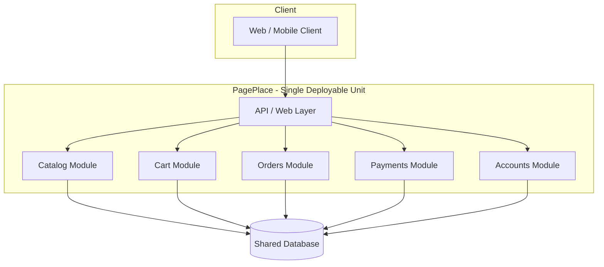
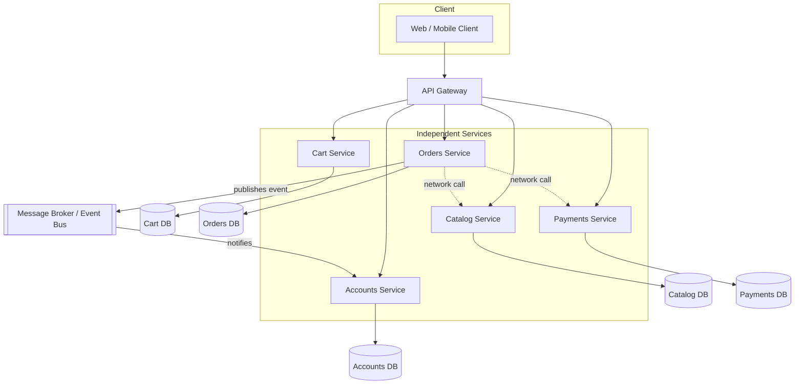

# Microservices vs. Monolith: A Practical Guide

*A training session for engineers new to software architecture*

---

## Table of Contents

1. [Introduction](#1-introduction)
2. [What Is a Monolith?](#2-what-is-a-monolith)
3. [What Is a Microservices Architecture?](#3-what-is-a-microservices-architecture)
4. [Side-by-Side Example: An Online Bookstore](#4-side-by-side-example-an-online-bookstore)
5. [Architecture Diagrams Compared](#5-architecture-diagrams-compared)
6. [Key Differences at a Glance](#6-key-differences-at-a-glance)
7. [When to Choose a Monolith](#7-when-to-choose-a-monolith)
8. [When to Choose Microservices](#8-when-to-choose-microservices)
9. [Real-World Case Studies](#9-real-world-case-studies)
   - [9.1 Amazon: Monolith → Microservices](#91-amazon-monolith--microservices)
   - [9.2 Netflix: Monolith → Microservices](#92-netflix-monolith--microservices)
   - [9.3 Prime Video: Microservices → Monolith](#93-prime-video-microservices--monolith)
   - [9.4 Segment: Microservices → Monolith](#94-segment-microservices--monolith)
10. [The "Monolith First" Philosophy](#10-the-monolith-first-philosophy)
11. [Decision Checklist](#11-decision-checklist)
12. [Summary Cheat Sheet](#12-summary-cheat-sheet)

---

## 1. Introduction

Every software system needs to be organized somehow. Two common ways to organize the *deployable units* of a system are:

- **Monolith**: one application, one codebase, one deployment.
- **Microservices**: many small, independently deployable services that talk to each other over a network.

This isn't a "good vs. bad" comparison — both are valid, widely-used approaches. The goal of this session is to help you recognize the trade-offs so you can make (or at least understand) an informed choice on the job.

> **Note:** All examples in this document are language-agnostic. The same ideas apply whether your stack is Java, Python, Node.js, Go, .NET, or anything else.

---

## 2. What Is a Monolith?

A monolith is a single application where all the functionality — user interface, business logic, data access — lives in **one codebase** and is deployed as **one unit** (one process, one container, one server, etc.).

**Characteristics:**
- One codebase, one build, one deployment artifact.
- All modules run in the same process and typically share the same database.
- Internal communication between modules is just function/method calls (fast, in-memory).
- Scaling means running more copies of the *entire* application, even if only one part is under load.

---

## 3. What Is a Microservices Architecture?

Microservices break the application into a set of small, independent services, each responsible for one business capability (e.g., "orders," "payments," "inventory"). Each service:

- Has its own codebase and can be deployed independently.
- Often owns its own database (no shared database across services).
- Communicates with other services over the network (REST, gRPC, message queues, events).
- Can be built, scaled, and even written in a different language than its neighbors.

---

## 4. Side-by-Side Example: An Online Bookstore

Imagine we're building "PagePlace," an online bookstore. It needs: a **catalog**, a **shopping cart**, **order processing**, **payments**, and **user accounts**.

### As a Monolith

All five capabilities are modules inside **one application**:

```
pageplace-app/
├── src/
│   ├── catalog/
│   ├── cart/
│   ├── orders/
│   ├── payments/
│   ├── accounts/
│   └── main (entry point)
├── shared-database/
└── build → single deployable (e.g., one .jar, one container, one binary)
```

A single request — "place an order" — flows through function calls inside one process:
`Cart.checkout()` → `Orders.create()` → `Payments.charge()` → `Catalog.reduceStock()`. All in-memory, all in one transaction, all sharing one database.

### As Microservices

Each capability becomes its own service, independently deployed, with its own database:

```
catalog-service/     → own DB   → own deployment
cart-service/        → own DB   → own deployment
orders-service/      → own DB   → own deployment
payments-service/    → own DB   → own deployment
accounts-service/    → own DB   → own deployment
```

The same "place an order" flow now happens over the **network**:
`Cart Service` calls `Orders Service` (HTTP/gRPC) → `Orders Service` calls `Payments Service` → `Orders Service` calls `Catalog Service` to reduce stock. Each hop can fail independently, needs retries, timeouts, and monitoring.

---

## 5. Architecture Diagrams Compared

### 5.1 Monolith Architecture



**Key point:** One box to deploy, one database, in-process calls between modules.

### 5.2 Microservices Architecture



**Key point:** Many independently deployable boxes, each with its own database, talking over the network or through events.

---

## 6. Key Differences at a Glance

| Dimension | Monolith | Microservices |
|---|---|---|
| Deployment | One unit, one deploy pipeline | Many units, many independent pipelines |
| Communication | In-process function calls (fast, reliable) | Network calls (latency, can fail) |
| Data | Usually one shared database | Database-per-service (no sharing) |
| Scaling | Scale the whole app together | Scale each service independently |
| Team structure | Works well for one team on one codebase | Works well for many teams owning separate services |
| Technology choices | Usually one language/stack | Can mix languages/stacks per service |
| Debugging | Single stack trace, easier locally | Distributed tracing needed across services |
| Failure behavior | A bug can crash the whole app | A single service can fail without taking down everything (if designed well) |
| Operational complexity | Low — one thing to deploy and monitor | High — service discovery, orchestration, observability, network reliability |
| Initial development speed | Fast to start | Slower to start — more infrastructure upfront |

---

## 7. When to Choose a Monolith

Choose a monolith when:

- **You're early-stage** — a startup or new product where the business domain isn't fully understood yet, and requirements will change quickly.
- **Team is small** (roughly 1–10 engineers). Coordinating many services needs more people than it saves.
- **You want to move fast** without investing in infrastructure (service discovery, distributed tracing, API gateways, etc.).
- **The domain isn't well understood yet.** It's much easier to reorganize modules inside one codebase than to redraw boundaries between deployed, independently-owned services.
- **Operational simplicity matters** more than independent scaling — one deployment, one log stream, one thing to monitor.

**Why:** Splitting a system into services *before* you understand its boundaries usually means guessing wrong — and undoing a wrong microservice boundary is far more expensive than undoing a wrong module boundary in a monolith.

---

## 8. When to Choose Microservices

Choose microservices when:

- **The organization is large** and multiple independent teams need to ship features without blocking each other.
- **Different parts of the system have very different scaling needs** (e.g., a checkout service that gets 100x the traffic of an admin dashboard).
- **You need independent deployability** — teams should be able to release their own service without coordinating a company-wide release.
- **The domain is well understood**, and clear boundaries between business capabilities already exist (often *after* a monolith has matured).
- **Fault isolation matters** — you want one failing component to degrade gracefully rather than take the whole system down.
- **You have (or are willing to build) the operational maturity** — CI/CD per service, container orchestration, centralized logging/tracing, on-call practices for distributed systems.

**Why:** Microservices trade simplicity for flexibility. They solve *organizational* scaling problems (many teams working independently) as much as technical scaling problems.

---

## 9. Real-World Case Studies

### 9.1 Amazon: Monolith → Microservices

In the early 2000s, Amazon's retail website (Obidos) was a large monolith. As the company and engineering org grew, code changes from one team increasingly broke unrelated features, and releases became slow and risky because everything shipped together. Amazon re-architected into what became one of the earliest large-scale service-oriented architectures, with small teams owning individual services end-to-end (a model later reflected in Amazon's "two-pizza team" and "you build it, you run it" culture). This shift is widely credited as one of the precursors to AWS itself, since the internal service infrastructure Amazon built for itself became the basis for external cloud services.

**Why they switched:** Organizational scale. Hundreds of teams needed to ship independently without stepping on each other.

### 9.2 Netflix: Monolith → Microservices

Netflix ran its streaming service on a monolithic architecture until a major database corruption incident in 2008 caused a multi-day outage, unable to ship DVDs to customers. This pushed Netflix to move to cloud infrastructure and decompose its monolith into hundreds of microservices over several years, each independently deployable and horizontally scalable, to survive the massive and unpredictable growth of streaming traffic.

**Why they switched:** Resilience and independent scalability at massive, unpredictable global traffic levels.

### 9.3 Prime Video: Microservices → Monolith

In 2023, the Amazon Prime Video team published a well-known account of moving their video-quality monitoring tool from a distributed microservices/serverless architecture back into a single monolithic process. Their microservices setup (separate Lambda functions coordinated via Step Functions) hit scaling limits and became too expensive — largely due to the cost of orchestration overhead and data transfer between services. Consolidating into one process reduced their infrastructure cost by about 90% and simplified scaling.

**Why they switched back:** For this specific, high-throughput, tightly-coupled workload, network hops and orchestration between services added cost and complexity without added benefit.

### 9.4 Segment: Microservices → Monolith

Segment (a customer data platform) built a microservices architecture where each customer integration ran as its own service. As the number of integrations grew into the hundreds, on-call engineers had to reason about a huge, tangled dependency graph, and most services were rarely deployed independently anyway — they were mostly deployed together. Segment consolidated these back into a single monolithic service, which simplified debugging, deployment, and on-call load significantly.

**Why they switched back:** The team's actual usage pattern didn't need independent deployability — the services weren't really "independent" in practice, so the operational cost of microservices outweighed the benefit.

---

## 10. The "Monolith First" Philosophy

A widely cited piece of advice (popularized by Martin Fowler and colleagues) is: **"Monolith First."**

The idea: almost no one gets service boundaries right on the first try, because you don't yet understand your domain well enough. Start with a well-structured monolith — organized internally into clear modules — and only split into microservices once:

1. You understand the domain and its natural boundaries well.
2. You've hit a real scaling or organizational pain point that microservices actually solve.
3. You have the operational tooling to support distributed systems.

A monolith built with clean internal module boundaries can be split into services later far more easily than a monolith built as a "big ball of mud."

---

## 11. Decision Checklist

Ask these questions before choosing an architecture:

- [ ] How many engineers/teams will work on this system?
- [ ] Do different parts of the system have significantly different scaling needs?
- [ ] Do we understand the business domain and its boundaries well enough to draw service lines confidently?
- [ ] Do we have (or can we build) the operational maturity for distributed systems (monitoring, tracing, orchestration)?
- [ ] Does the org need independent release cycles for different parts of the product?
- [ ] Is the extra network latency and failure surface of service-to-service calls acceptable for this use case?

If most answers point to "small team, evolving domain, limited ops maturity" → **start with a monolith.**
If most answers point to "large org, well-understood domain, uneven scaling needs, strong ops maturity" → **microservices are worth the investment.**

---

## 12. Summary Cheat Sheet

| | Monolith | Microservices |
|---|---|---|
| Best for | Small teams, new products, unclear domains | Large orgs, mature domains, uneven scaling |
| Main strength | Simplicity, speed, easy debugging | Independent scaling & deployment, team autonomy |
| Main risk | Becomes a "big ball of mud" if not modularized well | Distributed system complexity, network failure modes |
| Famous "went microservices" example | — | Amazon, Netflix |
| Famous "went back to monolith" example | Prime Video, Segment | — |
| Golden rule | Structure it well internally, even if it's one deployable | Don't split until real pain points justify it |

**Bottom line for fresh grads:** Microservices are not automatically "more advanced" or "better" — they solve organizational and scaling problems at a cost. A well-structured monolith is often the right choice, especially early on. The best architects are the ones who can justify *why* their choice fits the problem, not just follow the trend.
