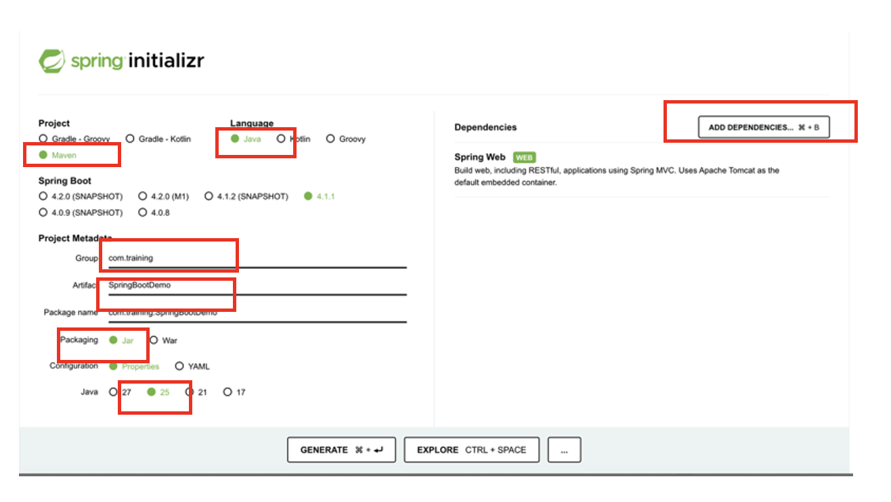
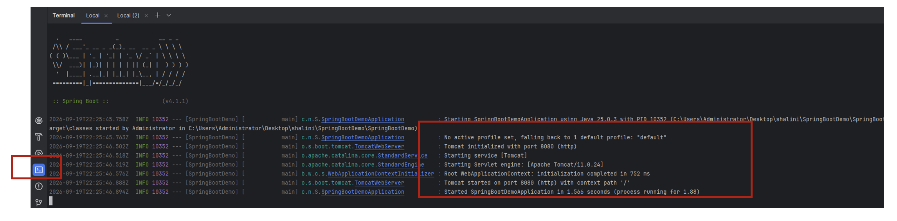
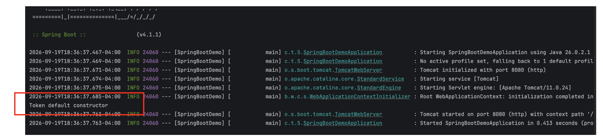
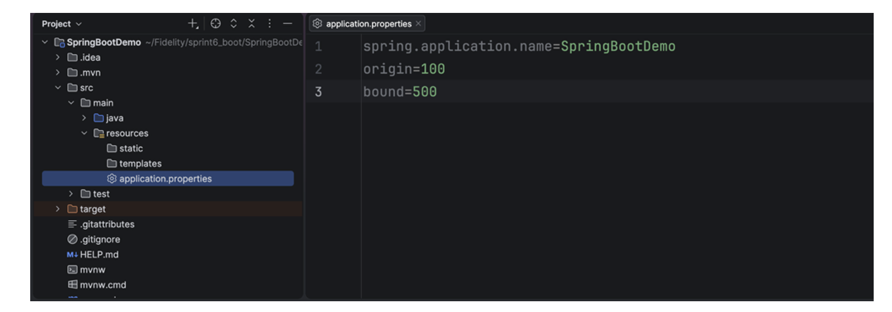
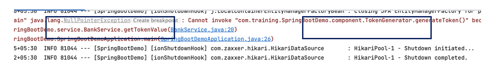

# Spring Boot Core

## Table of Contents

- [Spring Boot Core](#spring-boot-core)
  - [Table of Contents](#table-of-contents)
  - [Step 1: Spring Boot Project creation steps](#step-1-spring-boot-project-creation-steps)
  - [Step 2: Understand Spring Boot as opinionated](#step-2-understand-spring-boot-as-opinionated)
  - [Step 3: Understand Object creation in spring boot](#step-3-understand-object-creation-in-spring-boot)
  - [Step 4: Get bean context](#step-4-get-bean-context)
  - [Step 5: @Value Annotation](#step-5-value-annotation)
  - [Step 6: @Autowired and @Service Annotation](#step-6-autowired-and-service-annotation)
  - [Step 7: @Bean Annotation](#step-7-bean-annotation)
  - [Appendix: Basic Spring Boot Annotations](#appendix-basic-spring-boot-annotations)
    - [A. Bootstrapping and Configuration](#a-bootstrapping-and-configuration)
    - [B. Bean Creation (Stereotypes)](#b-bean-creation-stereotypes)
    - [C. Dependency Injection and Values](#c-dependency-injection-and-values)
    - [D. Bean Scope and Lifecycle](#d-bean-scope-and-lifecycle)
    - [Quick Examples](#quick-examples)

---

## Step 1: Spring Boot Project creation steps

1. Open below url on the browser:
   <https://start.spring.io/>

2. Enter details as shown below.

To add the dependencies, click on “Add Dependencies” and type “web”. Choose “Spring-web” and it should appear as below. Click on generate and the zip will be downloaded. Extract and open the project on intellij.



---

## Step 2: Understand Spring Boot as opinionated

1. View the pom.xml file that has spring boot starter parent.

   It is a special starter project that provides default configurations for our application and a complete dependency tree to quickly build our Spring Boot project.
   It also provides default configurations for Maven plugins, such as maven-failsafe-plugin, maven-jar-plugin, maven-surefire-plugin, and maven-war-plugin.

   Beyond that, it also inherits dependency management from spring-boot-dependencies, which is the parent to the spring-boot-starter-parent.

2. @SpringBootApplication on the class with the main method:

   This annotation is used to enable three features, that is:

   1. @EnableAutoConfiguration: enable Spring Boot's auto-configuration mechanism

   2. @ComponentScan: enable @Component scan on the package where the application is located.

   3. @Configuration: allow to register extra beans in the context or import additional configuration classes

3. To run the application either run the **main** method or open the terminal as highlighted below in the red box in intellij and type:

   ```
   mvn spring-boot:run
   ```

   It will take some time as it will download dependencies for the first time.
   After running the application, you should see the screen as below.

   

4. Read the logs it says, tomcat and the port number. This is called as opinionated and defaults with which spring boot ships in.

5. Whenever you have a maven project, .m2 folder is created within your system. To see:
   Open File Explorer, click on the address bar at the top, paste `%USERPROFILE%\.m2`, and hit Enter

---

## Step 3: Understand Object creation in spring boot

1. Create class as follows:

   ```java
   package com.training.SpringBootDemo.component;

   import java.util.Random;

   public class TokenGenerator{

       public TokenGenerator (){

           System.out.println("Token default constructor");

       }

       public int generateToken(){
           return new Random().nextInt(1,10);
       }
   }
   ```

2. Normally we create object and then call the respective method of the class.

   ```java
   TokenGenerator ob = new TokenGenerator ();
   ob.generateToken();
   ```

3. Object creation part is taken care by spring. Just add the annotation **@Component** on the class Token as follows:

   > The classes whose objects are created by spring are called as **“ SPRING MANAGED BEAN “**

   ```java
   import org.springframework.stereotype.Component;

   <mark>@Component</mark>
   public class TokenGenerator {
       // other methods
   }
   ```

4. **STOP THE APPLICATION AND RERUN.** You should see the output from the constructor.

   

---

## Step 4: Get bean context

1. To get access to the bean [class] created by spring, get it from spring context. Update main method as follows:

   ```java
   public static void main(String[] args) {

       ApplicationContext context =
               SpringApplication.run(SpringBootDemoApplication.class, args);

       TokenGenerator token = context.getBean(TokenGenerator.class);
       System.out.println(token.generateToken());

   }
   ```

2. **STOP THE APPLICATION AND RERUN.** You should see random token generated.

---

## Step 5: @Value Annotation

1. Instead of manually setting the bounds for generatetoken() function, add origin and bound as instance variables.

2. Add getters and setters for the same as follows:

3. DO UPDATE THE generateToken() for the parameters.

   ```java
   @Component
   public class TokenGenerator {
       private int origin;
       private int bound;

       public TokenGenerator (){
           System.out.println("Token default constructor");
       }

       public int getOrigin() {
           return origin;
       }

       public void setOrigin(int origin) {
           this.origin = origin;
       }

       public int getBound() {
           return bound;
       }

       public void setBound(int bound) {
           this.bound = bound;
       }

       public int generateToken(){
           return new Random().nextInt(origin,bound);
       }
   }
   ```

4. To set values for origin and bound, spring provides 3 ways to inject values

   1. Field

   2. Constructor

   3. Setter

5. To do field injection update Token class as follows :

   ```java
   @Component
   public class TokenGenerator {

       @Value("10")
       int origin;

       @Value("20")
       int bound;

       // other methods
   }
   ```

6. Now **re-run** the application and you should get the range of values between 10 and 20.

7. For setter injection, update Token class as follows **[ CAN CHOOSE TO COMMENT FIELD INJECTION ]**

   ```java
   @Value("20")
   public void setOrigin(int origin) {
       this.origin = origin;
   }

   @Value("30")
   public void setBound(int bound) {
       this.bound = bound;
   }
   ```

8. The data for @Value can also be provided from application.properties file. Open the file from within the resources folder and add the below:

   

9. Then update the setters of TokenGeneratore as follows:

   ```java
   @Value("${origin: 0}")
   public void setOrigin(int origin) {

       this.origin = origin;

   }

   @Value("${bound: 100}")
   public void setBound(int bound) {

       this.bound = bound;

   }
   ```

- `${bound}`: This looks for an external configuration property named bound in your application properties (like application.properties, application.yml, or system environment variables).

- `: 100`: This sets a default value of 100. If Spring cannot find a property named bound anywhere in your configuration files or environment, it will automatically assign 100 to the variable.

---

## Step 6: @Autowired and @Service Annotation

1. Consider below class BankService that has a dependency on TokenGenerator class.

   ```java
   public class BankService {

       private TokenGenerator tokenGenerator;

       public BankService() {
           System.out.println("Bank Service default constructor");
       }

       public BankService(TokenGenerator tokenGenerator) {
           this.tokenGenerator = tokenGenerator;
       }

       public TokenGenerator getTokenGenerator() {
           return tokenGenerator;
       }

       public void setTokenGenerator(TokenGenerator tokenGenerator) {
           this.tokenGenerator = tokenGenerator;
       }

       public void getTokenValue(){
           System.out.println(tokenGenerator.generateToken());
       }
   }
   ```

2. Can use @Component or @Service annotation on this class for spring to create object of BankService class.
   Update class as follows:

   ```java
   @Service
   public class BankService {
   }
   ```

- Using specialized annotations like @Service and @Repository instead of a generic @Component communicates clear architectural intent, improves code readability, and enables specialized framework features.

- Technically, @Service and @Repository are meta-annotated with @Component, meaning Spring treats them identically when creating basic beans. However, using them provides distinct advantages.

3. Run the application and will see the output from default constructor of BankService class.

4. Now get access of BankService class in the main method as follows and call the getTokenValue() method:

   ```java
   BankService bankService = context.getBean(BankService.class);
   bankService.getTokenValue();
   ```

5. It will throw NullPointerException for TokenGenerator class.

   

6. Even though TokenGenerator class object was created, spring needs to know it is required by BankService class. Normally we would do as follows:

   ```java
   TokenGenerator tokenGenerator = new TokenGenerator();
   BankService bankService = new BankService(tokenGenerator);
   //OR
   bankService.setTokenGenerator(tokenGenerator);
   ```

7. Hence use @Autowired annotation to tell spring to inject the TokenGenerator object created by spring.
   It can be done **ANY** of the following 3 ways.
   Use anyone, rerun the program and it should work now.

   1. Field injection: Add @Autowired on the filed as follows:

      ```java
      @Service
      public class BankService {
          @Autowired
          private TokenGenerator tokenGenerator;
          // …
      }
      ```

   2. Constructor injection:

      ```java
      @Autowired
      public BankService(TokenGenerator tokenGenerator) {
          System.out.println("Bank Service parameterized consturctor");
          this.tokenGenerator = tokenGenerator;
      }
      ```

   3. Setter injection:

      ```java
      @Autowired
      public void setTokenGenerator(TokenGenerator tokenGenerator) {
          System.out.println("Set token generator");
          this.tokenGenerator = tokenGenerator;
      }
      ```

8. the @Autowired annotation is no longer required on constructors **if the bean has only one parameterized constructor**. Spring automatically detects the single constructor and injects the necessary dependencies into it by default.

9. Comment the default constructor and remove the @Autowired annotation it works.

---

## Step 7: @Bean Annotation

1. CREATE a simple maven java project “PaymentProject” and create a class as follows:

   > Below code is within PaymentProject which is a Java Maven Project.
   > **[ PLEASE NOTE : IT IS NOT SPRING PROJECT]**
   >
   > It has only one class as follows

   ```java
   package com.payment;

   public class PaymentService {

       public double makePayment(double amount, double discount){

           amount = amount - amount * discount/100;

           double total = amount + 0.18;

           return total;

       }

   }
   ```

   > **VVIMP:**
   >
   > **Run maven install to create a jar file of PaymentProject and install within local repository.**

   ```
   mvn install
   ```

2. Add PaymentProject as maven dependency in pom.xml of **SpringBootDemo project**

   ```xml
   <dependency>

       <groupId>com.payment</groupId>

       <artifactId>PaymentProject</artifactId>

       <version>1.0-SNAPSHOT</version>

   </dependency>
   ```

3. Add PaymentService as a dependency in BillingService of **SpringBootDemo** project as follows

   ```java
   @Service
   public class BillingService {

       /**
        * payment service is not a part of this project and has been added as a dependency.
        * IN this case we cannot add @Component on the PaymentService class.
        */

       @Autowired
       private PaymentService paymentService;

       public void calculateCustomerPayment ()
       {

           System.out.println(paymentService.makePayment(12000,10));

       }

   }
   ```

4. To inject PaymentService as a dependency, use @Bean annotation as follows within the AppConfig class :

   ```java
   package com.training.SpringBootDemo.config;

   @Configuration
   public class AppConfig
   {
       @Bean
       public PaymentService service(){
           return new PaymentService();
       }
   }
   ```

5. Update the App class main method as follows:

   ```java
   BillingService bservice = context.getBean(BillingService.class);

   bservice. calculateCustomerPayment ();
   ```

---

## Appendix: Basic Spring Boot Annotations

A quick reference of the core Spring / Spring Boot annotations (application bootstrapping, configuration, bean creation and dependency injection). Web, data, security and testing annotations are intentionally excluded.

### A. Bootstrapping and Configuration

| Annotation | Package | Purpose | Covered in |
|---|---|---|---|
| `@SpringBootApplication` | `org.springframework.boot.autoconfigure` | Placed on the main class. Combines `@EnableAutoConfiguration`, `@ComponentScan` and `@Configuration`. | Step 2 |
| `@EnableAutoConfiguration` | `org.springframework.boot.autoconfigure` | Enables Spring Boot's auto-configuration based on the classpath and defined properties. | Step 2 |
| `@ComponentScan` | `org.springframework.context.annotation` | Scans the given package (and sub-packages) for Spring-managed components. | Step 2 |
| `@Configuration` | `org.springframework.context.annotation` | Marks a class as a source of bean definitions (`@Bean` methods). | Step 2, Step 7 |
| `@Import` | `org.springframework.context.annotation` | Imports one or more additional configuration classes. | – |
| `@PropertySource` | `org.springframework.context.annotation` | Loads an additional properties file into the Spring environment. | – |
| `@Profile` | `org.springframework.context.annotation` | Registers a bean/configuration only when the given profile is active. | – |

### B. Bean Creation (Stereotypes)

| Annotation | Package | Purpose | Covered in |
|---|---|---|---|
| `@Component` | `org.springframework.stereotype` | Generic stereotype; marks a class as a Spring-managed bean. | Step 3 |
| `@Service` | `org.springframework.stereotype` | Specialization of `@Component` for the business/service layer. | Step 6 |
| `@Repository` | `org.springframework.stereotype` | Specialization of `@Component` for the data-access layer. | Step 6 |
| `@Bean` | `org.springframework.context.annotation` | Declared on a method inside a `@Configuration` class; the returned object is registered as a bean. Useful for third-party classes you cannot annotate. | Step 7 |

### C. Dependency Injection and Values

| Annotation | Package | Purpose | Covered in |
|---|---|---|---|
| `@Autowired` | `org.springframework.beans.factory.annotation` | Injects a Spring bean by type via field, constructor or setter. Optional on a class with a single constructor. | Step 6 |
| `@Value` | `org.springframework.beans.factory.annotation` | Injects literal values or property placeholders, e.g. `@Value("${bound: 100}")`. | Step 5 |
| `@Qualifier` | `org.springframework.beans.factory.annotation` | Selects a specific bean by name when multiple beans of the same type exist. | – |
| `@Primary` | `org.springframework.context.annotation` | Marks a bean as the default choice when multiple candidates exist. | – |
| `@ConfigurationProperties` | `org.springframework.boot.context.properties` | Binds a group of properties (by prefix) from `application.properties`/`.yml` to a class. | – |

### D. Bean Scope and Lifecycle

| Annotation | Package | Purpose | Covered in |
|---|---|---|---|
| `@Scope` | `org.springframework.context.annotation` | Defines the bean scope, e.g. `singleton` (default) or `prototype`. | – |
| `@Lazy` | `org.springframework.context.annotation` | Delays bean creation until it is first requested. | – |
| `@PostConstruct` | `jakarta.annotation` | Method executed once after the bean is created and dependencies are injected. | – |
| `@PreDestroy` | `jakarta.annotation` | Method executed just before the bean is removed from the context. | – |

### Quick Examples

```java
// Selecting between multiple beans of the same type
@Autowired
@Qualifier("upiPayment")
private PaymentService paymentService;

// Default bean when several candidates exist
@Bean
@Primary
public PaymentService cardPayment() {
    return new PaymentService();
}

// A new instance on every request for the bean
@Component
@Scope("prototype")
public class TokenGenerator { }

// Lifecycle callbacks
@Component
public class StartupTask {

    @PostConstruct
    public void init() {
        System.out.println("Bean created and ready");
    }

    @PreDestroy
    public void cleanup() {
        System.out.println("Bean about to be destroyed");
    }
}

// Binding properties by prefix (application.properties: token.origin=10, token.bound=20)
@Component
@ConfigurationProperties(prefix = "token")
public class TokenProperties {
    private int origin;
    private int bound;
    // getters and setters
}
```
