# Spring Boot REST API — Step-by-Step Guide

## Table of Contents

- [Spring Boot REST API — Step-by-Step Guide](#spring-boot-rest-api--step-by-step-guide)
  - [Table of Contents](#table-of-contents)
  - [Step 1: Add Swagger](#step-1-add-swagger)
  - [Step 2: Prepare the Project](#step-2-prepare-the-project)
  - [Step 3: Understand @RestController and @RequestMapping](#step-3-understand-restcontroller-and-requestmapping)
  - [Step 4: @PathVariable](#step-4-pathvariable)
  - [Step 5: @RequestParam](#step-5-requestparam)
  - [Step 6: @PostMapping](#step-6-postmapping)
  - [Step 7: @PutMapping](#step-7-putmapping)
  - [Step 8: @DeleteMapping](#step-8-deletemapping)
  - [Step 9: Exception Handling](#step-9-exception-handling)
  - [Step 10: Bean Validation API](#step-10-bean-validation-api)
  - [Extras](#extras)
    - [Step 11: Logging in Spring Boot](#step-11-logging-in-spring-boot)
    - [Spring Boot Validation Annotations (Reference)](#spring-boot-validation-annotations-reference)
    - [Logging — Further Reading](#logging--further-reading)
  - [Appendix: Spring Web Annotations \& REST API Best Practices](#appendix-spring-web-annotations--rest-api-best-practices)
    - [A. Core Annotations Used in This Guide](#a-core-annotations-used-in-this-guide)
    - [B. Common Bean Validation Annotations](#b-common-bean-validation-annotations)
    - [C. REST API Best Practices](#c-rest-api-best-practices)

> **Note on this conversion:** The original document's table of contents also listed *"Step 10: XML Response"* and *"Step 14: Actuator and Health Metrics"* as upcoming topics. No content for those two sections exists in the source file (they appear to have been planned but never written), so they have been omitted from the numbered flow above rather than left as broken links. Everything else has been renumbered to match the order the steps actually appear in the body text.

---

## Step 1: Add Swagger

1. Add the dependency below to `pom.xml` of the existing project (what this is for will be discussed at a later stage):

   ```xml
   <dependency>
       <groupId>org.springdoc</groupId>
       <artifactId>springdoc-openapi-starter-webmvc-ui</artifactId>
       <version>2.6.0</version>
   </dependency>
   ```

   After adding the dependency, you will get an option to **reload** in `pom.xml`. Click on that, or configure IntelliJ to automatically load dependencies whenever you add one to the `pom.xml` file.

   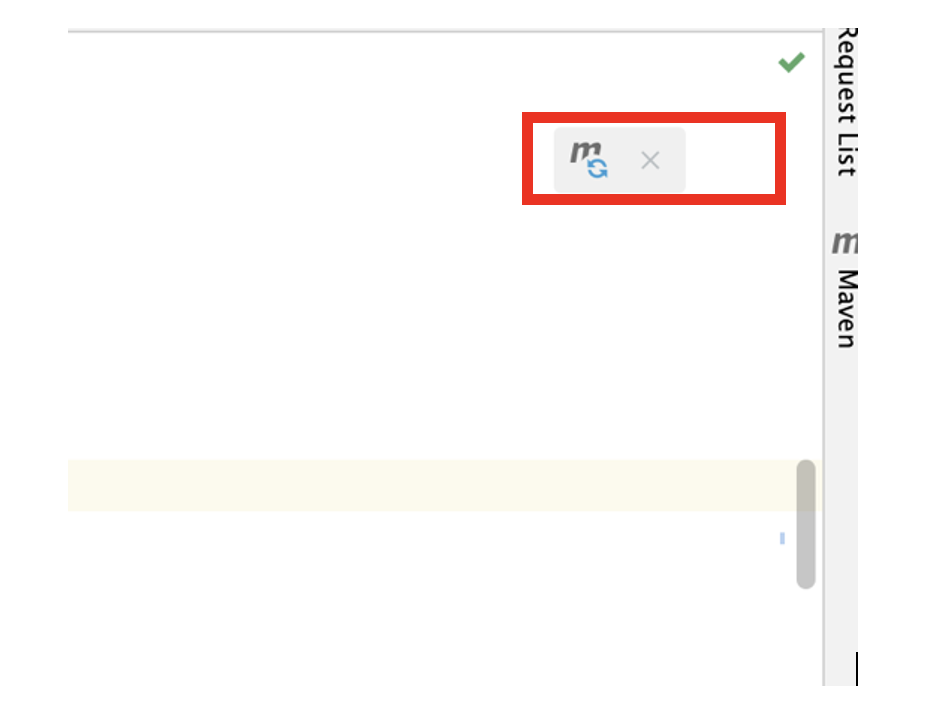

2. Rerun the application, open the browser, and go to the URL below. You should see the page shown in the image:

   ```
   http://localhost:8080/swagger-ui/index.html
   ```

   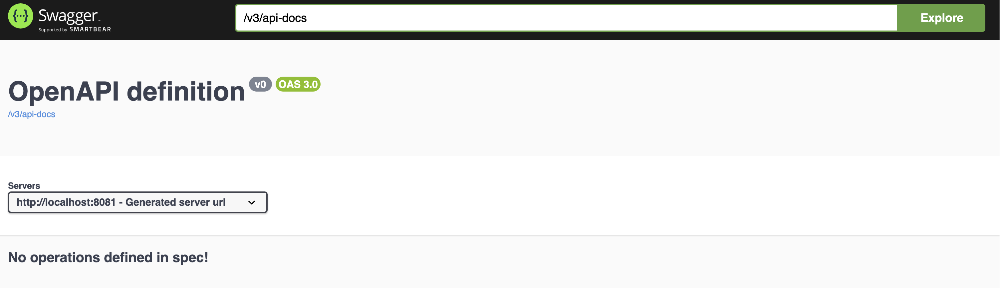

3. We will come back to Swagger later.

---

## Step 2: Prepare the Project

1. While creating classes, make sure you create **specific packages**, as highlighted in bold below.

2. Create a class `Book` as follows:

   ```java
   package com.training.SpringBootDemo.entity;

   public class Book {

       private int bookid;
       private String title;
       private String author;
       private String desc;
       private double price;

       public Book() {}

       public Book(int bookid, String title, String author, String desc, double price) {
           this.bookid = bookid;
           this.title = title;
           this.author = author;
           this.desc = desc;
           this.price = price;
       }

       public Book(String title, String author, String desc, double price) {
           this.title = title;
           this.author = author;
           this.desc = desc;
           this.price = price;
       }

       @Override
       public String toString() {
           return "Book{" +
                   "bookid=" + bookid +
                   ", title='" + title + '\'' +
                   ", author='" + author + '\'' +
                   ", desc='" + desc + '\'' +
                   ", price=" + price +
                   '}';
       }

       public int getBookid() { return bookid; }
       public void setBookid(int bookid) { this.bookid = bookid; }

       public String getTitle() { return title; }
       public void setTitle(String title) { this.title = title; }

       public String getAuthor() { return author; }
       public void setAuthor(String author) { this.author = author; }

       public String getDesc() { return desc; }
       public void setDesc(String desc) { this.desc = desc; }

       public double getPrice() { return price; }
       public void setPrice(double price) { this.price = price; }
   }
   ```

   > Package: `com.training.SpringBootDemo.**entity**`

3. Create the repository interface as follows:

   ```java
   package com.training.SpringBootDemo.repo;

   import com.training.SpringBootDemo.entity.Book;
   import java.util.List;

   public interface BookRepository {
       public long count();
       public List<Book> findAll();
       public Book save(Book book);
       public Book update(Book book);
       public List<Book> findAllByAuthor(String author);
       public void delete(int id);
       public Book findBookById(int id);
   }
   ```

4. Create the class below as the implementation of the interface above:

   ```java
   package com.training.SpringBootDemo.repo;

   import com.training.SpringBootDemo.entity.Book;
   import java.util.ArrayList;
   import java.util.List;

   @Repository
   public class InMemoryBookRepository implements BookRepository {

       private List<Book> bookList;

       public InMemoryBookRepository() {
           bookList = new ArrayList<>();
           bookList.add(new Book(1, "Core Java", "Hotsmann", "Learn java fundamentals", 130.0));
           bookList.add(new Book(2, "HTML", "Kelly", "Learn html for UI", 230.0));
           bookList.add(new Book(3, "python", "ryan", "Learn python fundamentals", 130.0));
           bookList.add(new Book(4, "css", "kelly", "Learn css for designing webpage", 130.0));
       }

       public long count() {
           return bookList.size();
       }

       @Override
       public List<Book> findAll() {
           return bookList;
       }

       @Override
       public Book save(Book book) {
           for (Book ob : bookList) {
               if (ob.getBookid() == book.getBookid())
                   throw new RuntimeException("Book with id " + book.getBookid() + " already exists");
           }
           Book lastBook = bookList.get(bookList.size() - 1);
           int id = lastBook.getBookid() + 1;
           book.setBookid(id);
           bookList.add(book);
           return book;
       }

       @Override
       public Book update(Book book) {
           for (int i = 0; i < bookList.size(); i++) {
               if (bookList.get(i).getBookid() == book.getBookid()) {
                   bookList.set(i, book);
                   return book;
               }
           }
           throw new RuntimeException("Book with id " + book.getBookid() + " does not exist");
       }

       @Override
       public void delete(int id) {
           for (int i = 0; i < bookList.size(); i++) {
               if (bookList.get(i).getBookid() == id) {
                   bookList.remove(i);
                   return;
               }
           }
           throw new RuntimeException("Book with id " + id + " does not exist");
       }

       @Override
       public List<Book> findAllByAuthor(String author) {
           List<Book> booksByAuthor = new ArrayList<>();
           for (Book ob : bookList) {
               if (ob.getAuthor().equalsIgnoreCase(author))
                   booksByAuthor.add(ob);
           }
           return booksByAuthor;
       }

       @Override
       public Book findBookById(int id) {
           for (Book ob : bookList) {
               if (ob.getBookid() == id)
                   return ob;
           }
           throw new RuntimeException("Book with id " + id + " does not exists");
       }
   }
   ```

   > Package: `com.training.SpringBootDemo.**repo**`

5. Create the service class as follows to provide book details:

   ```java
   package com.training.SpringBootDemo.service;

   import com.training.SpringBootDemo.entity.Book;
   import com.training.SpringBootDemo.repo.BookRepository;
   import org.springframework.stereotype.Service;
   import java.util.List;

   @Service
   public class BookService {

       private BookRepository repository;

       public BookService(BookRepository repository) {
           this.repository = repository;
       }

       public long getTotalBookCount() {
           return repository.count();
       }

       public List<Book> getAllBooks() {
           return repository.findAll();
       }

       public Book addNewBook(Book book) {
           return repository.save(book);
       }

       public Book updateBook(Book book) {
           Book savedBook = null;
           savedBook = repository.update(book);
           return savedBook;
       }

       public void deleteBook(int id) {
           repository.delete(id);
       }

       public List<Book> getBooksByAuthor(String author) {
           return repository.findAllByAuthor(author);
       }

       public Book getBookById(int id) {
           return repository.findBookById(id);
       }
   }
   ```

   > Package: `com.training.SpringBootDemo.**service**`

---

## Step 3: Understand @RestController and @RequestMapping

1. To inform Spring that a class is exposing data over HTTP, we use the `@RestController` annotation on the class.

2. Create a class `BookRestController` as follows:

   ```java
   package com.training.SpringBootDemo.rest;

   import org.springframework.web.bind.annotation.RestController;

   @RestController
   public class BookRestController {

       public BookRestController() {
           System.out.println("Book Rest Controller default constructor");
       }
   }
   ```

   > Package: `com.training.SpringBootDemo.**rest**`

3. Rerun the application — you should see the output from the `BookRestController` constructor.

4. This class needs a reference to the `BookService` class to get the data. Update the default constructor to a parameterized one:

   ```java
   @RestController
   public class BookRestController {

       private BookService bookService;

       public BookRestController(BookService bookService) {
           System.out.println("Book Rest Controller default constructor");
           this.bookService = bookService;
       }

       // other parts are same

       public List<Book> getBooks() {
           return bookService.getAllBooks();
       }
   }
   ```

5. To expose the data, annotate the class with `@RequestMapping` to specify the exposed endpoint URI, and annotate the method with `@GetMapping` to fetch data:

   ```java
   @RestController
   @RequestMapping("/books")
   public class BookRestController {
       // other parts are same

       @GetMapping
       public List<Book> getBooks() {
           return bookService.getAllBooks();
       }
   }
   ```

   > <mark>**MAKE SURE TO RESTART THE SERVER**</mark>

   It will be available at `http://localhost:8080/books`.

   Or you can use the curl command:

   ```bash
   curl http://localhost:8080/books
   ```

6. This can be checked on Swagger as well. Swagger is used for REST endpoint documentation and testing. Go to the browser and type in the URL below:

   ```
   http://localhost:8081/swagger-ui/index.html#/
   ```

   You should see the output below:

   

   When you click on the arrow, you get **Try it out**. Clicking on that gives you the option to **Execute**.

   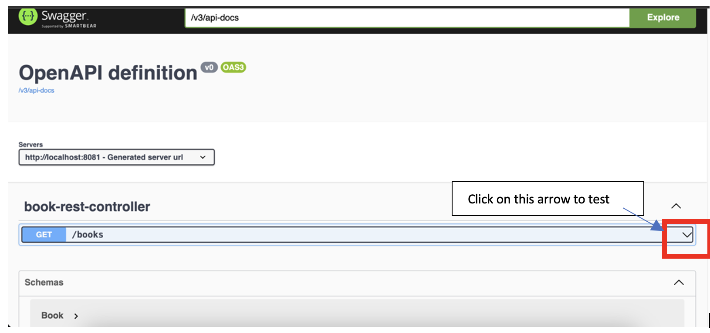

   Click **Execute** and you should see the JSON response shown below:

   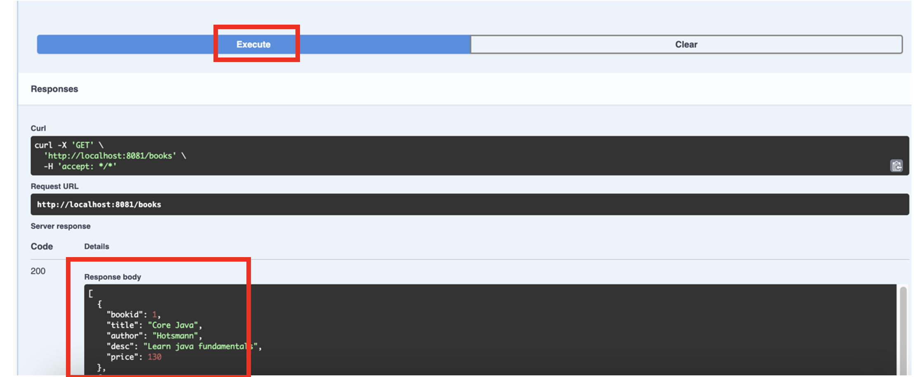

---

## Step 4: @PathVariable

1. Update the controller and add the method below to return a book by id:

   ```java
   public Book getBookById(int id) {
       return bookService.getBookById(id);
   }
   ```

2. To make this method available as a REST API endpoint and return a book for a specific id, update the method as follows:

   ```java
   @GetMapping("/{id}")
   public Book getBookById(@PathVariable int id) {
       return bookService.getBookById(id);
   }
   ```

   > <mark>**MAKE SURE TO RESTART THE SERVER**</mark> and test on Swagger, in the browser, or using curl: `http://localhost:8080/books/1`

   - `{}` is the placeholder for the value (e.g. `1`) passed in the URL.
   - `{id}` is mapped to the method parameter `id` using the `@PathVariable` annotation.

3. If you try to access a book that does not exist, you should get a **500 error**.

   > curl -i http://localhost:8081/books/10 
   > OR 
   > curl http://localhost:8081/books/10
   
   On the IDE console, you will see the exception:

   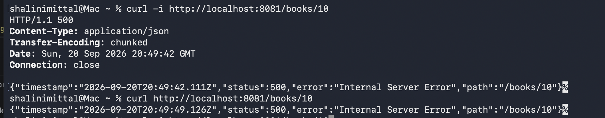

   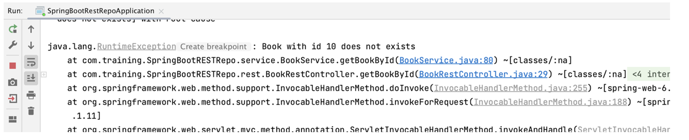

4. Displaying an internal server error is not good pVractice. Let's modify the code to handle the exception and return an appropriate response along with the respective status code. Spring provides the `ResponseEntity` class to wrap the data and any extra information to be returned.

   a. Create a class as follows:

      ```java
      package com.training.SpringBootDemo.constants;

      public class AppConstants {
          public static final String SUCCESS = "success";
          public static final String FAILURE = "failure";
          public static final String STATUS = "status";
          public static final String ERROR = "error";
      }
      ```

   b. Update `getBookById` as follows:

      ```java
      @GetMapping("/{id}")
      public ResponseEntity<Object> getBookById(@PathVariable int id) {
          Map<String, Object> map = new HashMap<>();
          try {
              map.put(AppConstants.STATUS, AppConstants.SUCCESS);
              map.put("book", bookService.getBookById(id));
              return ResponseEntity.ok(map);
          } catch (RuntimeException e) {
              return ResponseEntity.notFound().build();
          }
      }
      ```

      Check now for both success and failure. <mark>**MAKE SURE TO RESTART THE SERVER**</mark>

---

## Step 5: @RequestParam

1. The `getBooks` method returns all books. How about giving users the choice to get books filtered by author? This should be **optional** — if no filter is provided, return all books. Use the `@RequestParam` annotation for this. Update the method as follows:

   ```java
   @GetMapping
   public List<Book> getBooks(@RequestParam String author) {
       if (author == null)
           return bookService.getAllBooks();
       return bookService.getBooksByAuthor(author);
   }
   ```

   > <mark>**MAKE SURE TO RESTART THE SERVER**</mark>
   >
   > To access, type this URL in Postman: `http://localhost:8080/books` — you will get a **Bad Request**, status **400**.

   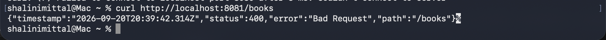

   > And if you check in IDE console should get below error message.

   
   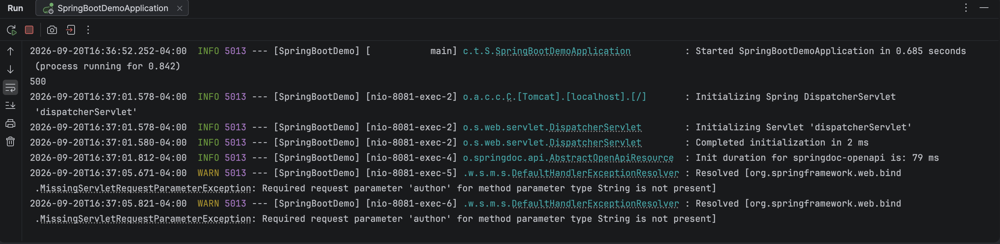

   >
   > Now access this URL instead: `http://localhost:8081/books?author=kelly`

2. The problem is that providing a value for `author` is currently mandatory. Update the method to make `author` optional (`required = false`):

   ```java
   @GetMapping
   public List<Book> getBooks(@RequestParam(required = false) String author) {
       if (author == null)
           return bookService.getAllBooks();
       return bookService.getBooksByAuthor(author);
   }
   ```

   > <mark>**MAKE SURE TO RESTART THE SERVER**</mark>
   >
   > Now this URL works fine without providing a value for `author`: `http://localhost:8080/books`

---

## Step 6: @PostMapping

1. To add a new book, we use the `@PostMapping` annotation. Add the method below to the controller:

   ```java
   @PostMapping
   public ResponseEntity<Object> addBook(Book book) {
       System.out.println("Book " + book);
       Map<String, Object> map = new HashMap<>();
       try {
           map.put(AppConstants.STATUS, AppConstants.SUCCESS);
           Book savedBook = bookService.addNewBook(book);
           map.put("book", savedBook);
           URI location = URI.create("/books/" + savedBook.getBookid());
           return ResponseEntity.created(location).body(savedBook);
       } catch (RuntimeException e) {
           map.put(AppConstants.STATUS, AppConstants.FAILURE);
           map.put("error", e.getMessage());
           return ResponseEntity.badRequest().body(map);
       }
   }
   ```

   The URI represents the location of the newly created resource. `created()` sets the HTTP status to **201 Created**, but it also does something else important: it sets the `Location` response header. The response would look approximately like this:

   ```
   HTTP/1.1 201 Created
   Location: /books/25
   Content-Type: application/json
   ```

   > <mark>**MAKE SURE TO RESTART THE SERVER**</mark>

   Try this using the curl command below:

   ```bash
   curl -si -X POST http://localhost:8081/books -H 'accept: */*' -H 'Content-Type: application/json' \
   -d '{"title": "AWS", "author": "ryan","desc": "Learn aws fundamentals","price": 530.0}'
   ```

   - `-s` → don't show curl progress
   - `-i` → show HTTP response headers
   - `-X` → specify the HTTP method
   - `-H` → add an HTTP header
   - `\` → not part of HTTP; it's a shell feature meaning "the command continues on the next line"
   - `-d` → send data in the HTTP request body

   You will get the output below — **HMMMM????**

   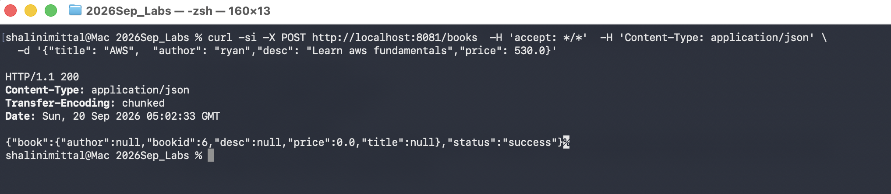

   Check the IDE console — the book data is `null`:

   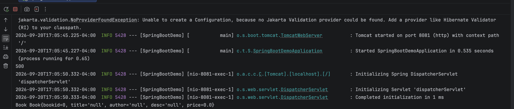

2. It looks like Spring was not able to map the data coming in the request to the Java class. We need to add `@RequestBody` on the method parameter for Spring to know how to map the JSON data to the Java class:

   ```java
   @PostMapping
   public ResponseEntity<Object> addBook(@RequestBody Book book) {
       System.out.println("Book " + book);
       Map<String, Object> map = new HashMap<>();
       try {
           map.put(AppConstants.STATUS, AppConstants.SUCCESS);
           map.put("book", bookService.addNewBook(book));
           return ResponseEntity.ok(map);
       } catch (RuntimeException e) {
           map.put(AppConstants.STATUS, AppConstants.FAILURE);
           map.put("error", e.getMessage());
           return ResponseEntity.badRequest().body(map);
       }
   }
   ```

   > <mark>**MAKE SURE TO RESTART THE SERVER**</mark>

   Now checking the URL above for POST will work as expected — **DO NOT FORGET THE HEADER**.

   Also check adding a book that already exists. You should get output as follows — **DO NOT FORGET THE HEADER**:

   ```bash
   curl -si -X POST http://localhost:8081/books -H 'accept: */*' -H 'Content-Type: application/json' \
   -d '{"title": "AWS", "author": "ryan","desc": "Learn aws fundamentals","price": 530.0,"bookid":1}'
   ```

   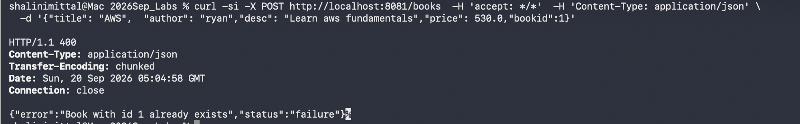

---

## Step 7: @PutMapping

1. To update a book, add the method below:

   ```java
   @PutMapping
   public ResponseEntity<Object> updateBook(@RequestBody Book book) {
       System.out.println("Book " + book);
       Map<String, Object> map = new HashMap<>();
       try {
           map.put(AppConstants.STATUS, AppConstants.SUCCESS);
           map.put("book", bookService.updateBook(book));
           return ResponseEntity.ok(map);
       } catch (RuntimeException e) {
           map.put(AppConstants.STATUS, AppConstants.FAILURE);
           map.put("error", e.getMessage());
           return ResponseEntity.badRequest().body(map);
       }
   }
   ```

   > <mark>**MAKE SURE TO RESTART THE SERVER**</mark> — use curl with `-X PUT`:

   ```bash
   curl -si -X PUT http://localhost:8081/books -H 'accept: */*' -H 'Content-Type: application/json' \
   -d '{"author":"Cay Hotsmann","bookid":1,"desc":"Learn java fundamentals and become an expert","price":130.0,"title":"Core Java"}'
   ```

   Try updating a book that does not exist as well.

---

## Step 8: @DeleteMapping

1. To delete a book, add the method below:

   ```java
   @DeleteMapping("/{id}")
   public ResponseEntity<Object> deleteBook(@PathVariable int id) {
       Map<String, Object> map = new HashMap<>();
       try {
           map.put(AppConstants.STATUS, AppConstants.SUCCESS);
           if (bookService.deleteBook(id)) {
               map.put("message", "Book deleted successfully");
               return ResponseEntity.ok(map);
           }
       } catch (RuntimeException e) {
           map.put(AppConstants.STATUS, AppConstants.FAILURE);
           map.put("error", e.getMessage());
       }
       return ResponseEntity.badRequest().body(map);
   }
   ```

   > <mark>**MAKE SURE TO RESTART THE SERVER**</mark> — use `-X DELETE` in the curl command.

   Try success and failure deletion for a book that exists and one that doesn't.

---

## Step 9: Exception Handling

1. In the previous `BookRestController`, every method is responsible for handling its own exceptions. There is a lot of repetition in the exception-handling code. Spring Boot provides a central exception handler in two ways:

   1. **Use `@ExceptionHandler`**

      Spring Boot provides the `@ExceptionHandler` annotation to handle exceptions thrown by a specific controller method. This annotation can be used to provide customized error responses for specific exceptions.

   2. Create a new **REST Controller** as follows and look at the method with `@ExceptionHandler`.

      > <mark>**DO NOT FORGET TO CHANGE THE REQUEST MAPPING AS HIGHLIGHTED BELOW**</mark> — in the source document, the `@RequestMapping("/books/ex")` line below is highlighted for emphasis.

      ```java
      package com.boot.demo.springbootdemo.rest;

      import com.boot.demo.springbootdemo.entity.Book;
      import com.boot.demo.springbootdemo.service.BookServiceRepo;
      import com.boot.demo.springbootdemo.utility.AppConstants;
      import org.springframework.beans.factory.annotation.Autowired;
      import org.springframework.http.HttpStatus;
      import org.springframework.http.ResponseEntity;
      import org.springframework.web.bind.annotation.*;
      import java.util.HashMap;
      import java.util.List;
      import java.util.Map;

      @RestController
      @RequestMapping("/books/ex")
      public class BookRestControllerExceptionHandler {

          @Autowired
          private BookServiceRepo bookService;

          public BookRestControllerExceptionHandler() {
              System.out.println("Book Rest Controller default constructor");
          }

          @ExceptionHandler(RuntimeException.class)
          public ResponseEntity<Object> handleResourceNotFoundException(RuntimeException ex) {
              Map<String, Object> body = new HashMap<>();
              body.put("error", ex.getMessage());
              return new ResponseEntity<>(body, HttpStatus.NOT_FOUND);
          }

          @GetMapping
          public List<Book> getBooks(@RequestParam(required = false) String author) {
              if (author == null)
                  return bookService.getAllBooks();
              return bookService.getBooksByAuthor(author);
          }

          @GetMapping("/{id}")
          public ResponseEntity<Object> getBookById(@PathVariable int id) {
              Map<String, Object> map = new HashMap<>();
              map.put(AppConstants.STATUS, AppConstants.SUCCESS);
              map.put("book", bookService.getBookById(id));
              return ResponseEntity.ok(map);
          }

          @PostMapping
          public ResponseEntity<Object> addBook(@RequestBody Book book) {
              System.out.println("Book " + book);
              Map<String, Object> map = new HashMap<>();
              map.put(AppConstants.STATUS, AppConstants.SUCCESS);
              map.put("book", bookService.addNewBook(book));
              return ResponseEntity.ok(map);
          }

          @PutMapping
          public ResponseEntity<Object> updateBook(@RequestBody Book book) {
              System.out.println("Book " + book);
              Map<String, Object> map = new HashMap<>();
              map.put(AppConstants.STATUS, AppConstants.SUCCESS);
              map.put("book", bookService.updateBook(book));
              return ResponseEntity.ok(map);
          }

          @DeleteMapping("/{id}")
          public ResponseEntity<Object> deleteBook(@PathVariable int id) {
              Map<String, Object> map = new HashMap<>();
              map.put(AppConstants.STATUS, AppConstants.SUCCESS);
              if (bookService.deleteBook(id)) {
                  map.put("message", "Book deleted successfully");
                  return ResponseEntity.ok(map);
              }
              return ResponseEntity.badRequest().body(map);
          }
      }
      ```

   3. **Use `@ControllerAdvice`**

      Spring Boot provides the `@ControllerAdvice` annotation to handle exceptions globally, across all controllers. This annotation can be used to provide a centralized error-handling mechanism for an entire application.

   4. Create a class as follows to handle global exceptions:

      ```java
      package com.boot.demo.springbootdemo.exception;

      import org.springframework.http.HttpStatus;
      import org.springframework.http.ResponseEntity;
      import org.springframework.web.bind.annotation.ControllerAdvice;
      import org.springframework.web.bind.annotation.ExceptionHandler;
      import java.util.HashMap;
      import java.util.Map;

      @ControllerAdvice
      public class MyGlobalHandler {

          MyGlobalHandler() {
              System.out.println("Global handler");
          }

          @ExceptionHandler(Exception.class)
          public ResponseEntity<Object> handleResourceNotFoundException(Exception ex) {
              Map<String, Object> body = new HashMap<>();
              body.put("message", ex.getMessage());
              return new ResponseEntity<>(body, HttpStatus.NOT_FOUND);
          }
      }
      ```

   5. To test the global handler, make a request as before and observe the global handler in action.

---

## Step 10: Bean Validation API

1. Add the dependency below:

   ```xml
   <dependency>
       <groupId>org.springframework.boot</groupId>
       <artifactId>spring-boot-starter-validation</artifactId>
   </dependency>
   ```

2. Add the annotations below to the entity class (both are <mark>highlighted in the source document</mark> to call out that they are new):

   ```java
   @NotNull(message = "Title must not be empty")
   private String author;

   @Positive(message = "Price must be positive")
   private double price;
   ```

3. Update the controller as follows (`@Valid`, below, is <mark>highlighted in the source document</mark>):

   ```java
   public ResponseEntity<Object> addBook(@Valid @RequestBody Book book)
   ```

4. Now run the code and POST the JSON below:

   ```json
   {
       "bookid": 0,
       "title": "string",
       "desc": "string",
       "price": -100
   }
   ```

   You should get an exception.

5. To provide a custom exception handler, add the code below:

   ```java
   @ExceptionHandler({Exception.class, MethodArgumentNotValidException.class})
   public ResponseEntity<Object> handleException(Exception ex) {
       Map<String, Object> map = new HashMap<>();
       map.put(AppConstants.STATUS, AppConstants.FAILURE);
       if (ex instanceof MethodArgumentNotValidException) {
           String msg = ((MethodArgumentNotValidException) ex).getAllErrors()
                   .stream().map(ObjectError::getDefaultMessage)
                   .collect(Collectors.joining(","));
           map.put("error", msg);
           return ResponseEntity.badRequest().body(map);
       }
       System.out.println("general exception");
       System.out.println(ex.getMessage());
       map.put("error", ex.getMessage());
       return ResponseEntity.badRequest().body(map);
   }
   ```

---

## Extras

### Step 11: Logging in Spring Boot

1. In Spring Boot, the `spring-boot-starter-logging` dependency includes the logging frameworks. Since many Spring Boot starters include `spring-boot-starter-logging` automatically, we're unlikely to need to add it manually.

   For example, adding the `spring-boot-starter-web` dependency will automatically include `spring-boot-starter-logging`.

2. By default, Spring Boot uses **Logback** for logging, and the loggers are pre-configured to use console output with optional file output.

3. To use logging, perform the steps below in the `BookRestController` class:

   a. Add the line below just above the constructor:

      ```java
      Logger logger = LoggerFactory.getLogger(BookRestController.class);
      ```

   b. Add the line below within the `getBooks()` method:

      ```java
      logger.info("GET All books if author is null or get books by author : " + author);
      ```

4. Restart the server — you should see output in the IntelliJ terminal, as shown below, when you make a GET request to `http://localhost:8081/books`:

   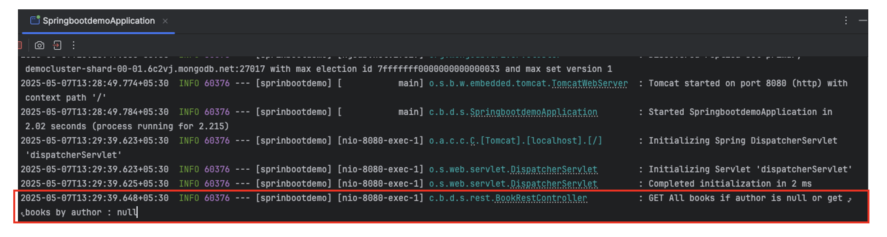

5. To send logs to a file, add the line below to `application.properties`:

   ```properties
   logging.file.name=logs/app.log
   ```

   Log files rotate when they reach 10 MB. If you restart the server and make a request to `http://localhost:8081/books`, you should see a `logs` folder and a file `app.log` within it.

6. **Log levels**, from most to least verbose:

   - `TRACE`
   - `DEBUG`
   - `INFO`
   - `WARN`
   - `ERROR`
   - `OFF`

   When the log level is set to `INFO` (the default), it logs `INFO`, `WARN`, and `ERROR` events. When set to `DEBUG`, it logs `DEBUG`, `INFO`, `WARN`, and `ERROR` events. When set to `ERROR`, it logs only `ERROR` events.

7. We can define log levels in `application.properties`:

   ```properties
   # root level
   logging.level.root=error

   # package level logging
   logging.level.org.springframework.web=debug
   logging.level.org.hibernate=error
   logging.level.com.mkyong=error
   ```

### Spring Boot Validation Annotations (Reference)

There are more such annotations available to validate request data. Check them out when needed:

| Annotation | Description |
|---|---|
| `@AssertFalse` | The annotated element must be `false`. |
| `@AssertTrue` | The annotated element must be `true`. |
| `@DecimalMax` | The annotated element must be a number whose value is lower than or equal to the specified maximum. |
| `@DecimalMin` | The annotated element must be a number whose value is higher than or equal to the specified minimum. |
| `@Future` | The annotated element must be an instant, date, or time in the future. |
| `@Max` | The annotated element must be a number whose value is lower than or equal to the specified maximum. |
| `@Min` | The annotated element must be a number whose value is higher than or equal to the specified minimum. |
| `@Negative` | The annotated element must be a strictly negative number. |
| `@NotBlank` | The annotated element must not be null and must contain at least one non-whitespace character. |
| `@NotEmpty` | The annotated element must not be null nor empty. |
| `@NotNull` | The annotated element must not be null. |
| `@Null` | The annotated element must be null. |
| `@Pattern` | The annotated `CharSequence` must match the specified regular expression. |
| `@Positive` | The annotated element must be a strictly positive number. |
| `@Size` | The annotated element's size must be between the specified boundaries (inclusive). |

### Logging — Further Reading

- Overview: [mkyong.com — Spring Boot Logging Example](https://mkyong.com/spring-boot/spring-boot-logging-example/)
- Official reference: [Spring Boot Logging Docs](https://docs.spring.io/spring-boot/reference/features/logging.html)

---

## Appendix: Spring Web Annotations & REST API Best Practices

### A. Core Annotations Used in This Guide

| Annotation | Applied To | Purpose |
|---|---|---|
| `@RestController` | Class | Marks a class as a REST endpoint provider; combines `@Controller` + `@ResponseBody` so every method's return value is written directly to the HTTP response body (typically as JSON). |
| `@RequestMapping` | Class / Method | Maps HTTP requests to handler classes or methods. Can specify a base path, HTTP method, headers, and content types. Used at the class level in this guide to define a base path such as `/books`. |
| `@GetMapping` | Method | Shorthand for `@RequestMapping(method = RequestMethod.GET)`. Handles HTTP GET requests — used for reading/fetching data. |
| `@PostMapping` | Method | Shorthand for `@RequestMapping(method = RequestMethod.POST)`. Handles HTTP POST requests — used for creating new resources. |
| `@PutMapping` | Method | Shorthand for `@RequestMapping(method = RequestMethod.PUT)`. Handles HTTP PUT requests — used for fully updating an existing resource. |
| `@DeleteMapping` | Method | Shorthand for `@RequestMapping(method = RequestMethod.DELETE)`. Handles HTTP DELETE requests — used for removing a resource. |
| `@PathVariable` | Method parameter | Binds a URI template variable (e.g. `/{id}`) to a method parameter. |
| `@RequestParam` | Method parameter | Binds a query string parameter (e.g. `?author=kelly`) to a method parameter. Supports `required`, `defaultValue`, and `name` attributes. |
| `@RequestBody` | Method parameter | Deserializes the HTTP request body (typically JSON) into a Java object, using Spring's configured `HttpMessageConverter`. |
| `@ResponseBody` | Method / Class | Indicates the return value should be bound directly to the web response body. Implied automatically by `@RestController`. |
| `@Valid` | Method parameter | Triggers Bean Validation on the annotated object (typically paired with `@RequestBody`) before the handler method executes. |
| `@ExceptionHandler` | Method | Declares a method (within a controller or a `@ControllerAdvice` class) as a handler for one or more exception types, letting it return a custom error response. |
| `@ControllerAdvice` | Class | Declares a class as a global handler that applies across *all* controllers — commonly used together with `@ExceptionHandler` for centralized error handling. |
| `@RestControllerAdvice` | Class | Combines `@ControllerAdvice` and `@ResponseBody`; a more modern alternative for REST APIs so responses are automatically serialized (e.g. to JSON) without needing a separate `@ResponseBody`. |
| `@Repository` | Class | Marks a class as a persistence/data-access component; enables Spring's exception translation for that bean. |
| `@Service` | Class | Marks a class as holding business/service logic; primarily a semantic stereotype for readability and component scanning. |
| `@Component` | Class | Generic stereotype marking any class as a Spring-managed bean; `@Service`, `@Repository`, and `@Controller` are all specializations of it. |
| `@Autowired` | Field / Constructor / Setter | Requests Spring to inject a matching bean. Constructor injection (as used with `BookService` in this guide) is preferred over field injection for testability and immutability. |

### B. Common Bean Validation Annotations

| Annotation | Description |
|---|---|
| `@NotNull` | Value must not be `null`. |
| `@NotEmpty` | Value must not be `null` or empty (collections, strings, arrays, maps). |
| `@NotBlank` | String must not be `null` and must contain at least one non-whitespace character. |
| `@Size(min=, max=)` | Size/length must fall within the given bounds. |
| `@Min` / `@Max` | Numeric value must be ≥ / ≤ the specified bound. |
| `@Positive` / `@PositiveOrZero` | Number must be strictly positive / positive or zero. |
| `@Negative` / `@NegativeOrZero` | Number must be strictly negative / negative or zero. |
| `@Pattern(regexp=)` | String must match the given regular expression. |
| `@Email` | String must be a well-formed email address. |
| `@Past` / `@Future` | Date/time must be in the past / future. |

### C. REST API Best Practices

1. **Use nouns, not verbs, in URIs.** Prefer `GET /books/{id}` over `GET /getBookById/{id}`. The HTTP method already conveys the action.
2. **Use the right HTTP method and status code for the operation.**
   - `GET` → 200 OK (read, safe & idempotent)
   - `POST` → 201 Created (create a new resource; include a `Location` header pointing to the new resource, as shown with `ResponseEntity.created(location)`)
   - `PUT` → 200 OK / 204 No Content (full update; idempotent)
   - `PATCH` → 200 OK (partial update)
   - `DELETE` → 200 OK / 204 No Content (remove a resource; idempotent)
   - `4xx` for client errors (e.g. 400 Bad Request, 404 Not Found, 409 Conflict), `5xx` only for genuine server-side failures.
3. **Never leak raw stack traces or generic 500 errors to clients.** Centralize error handling with `@ControllerAdvice`/`@RestControllerAdvice` and `@ExceptionHandler`, and always return a consistent, structured error body (e.g. `{ "status": "failure", "error": "..." }`).
4. **Validate input at the boundary.** Use `@Valid` with Bean Validation annotations on request bodies so bad input is rejected before it reaches business logic, and translate `MethodArgumentNotValidException` into a clear 400 response.
5. **Make `@RequestParam` optional where it makes sense**, using `required = false` (optionally with `defaultValue`), rather than forcing every caller to supply every filter.
6. **Prefer constructor injection over field injection** for required dependencies (e.g. injecting `BookRepository` into `BookService` via the constructor) — it makes dependencies explicit and classes easier to unit test.
7. **Keep controllers thin.** Controllers should handle HTTP concerns (mapping, status codes, request/response shaping) and delegate business logic to service classes, and data access to repository classes — the layering used throughout this guide (`rest` → `service` → `repo`).
8. **Version your API** (e.g. `/api/v1/books`) once it's consumed externally, so breaking changes don't silently break existing clients.
9. **Use DTOs instead of exposing entities directly** in larger/production applications, so your persistence model can evolve independently of your public API contract.
10. **Document your API with Swagger/OpenAPI** (`springdoc-openapi`, as set up in Step 1) and keep it up to date — it doubles as living documentation and a manual testing tool.
11. **Log meaningfully, not excessively.** Use appropriate log levels (`INFO` for normal flow, `WARN`/`ERROR` for problems) so production logs stay useful and searchable, and avoid logging sensitive data (passwords, tokens, full payloads with PII).
12. **Restart/reload consistently while developing.** Many of the "gotchas" in this guide (annotations not taking effect, stale behavior) are resolved simply by restarting the server after a code change — hence the repeated <mark>**MAKE SURE TO RESTART THE SERVER**</mark> reminders.
13. **Be consistent with response envelopes.** Whatever shape you choose (a `Map` with `status`/`book`/`error` keys, as in this guide, or a formal DTO), use it consistently across endpoints so client code can rely on it.
14. **Return 404, not 500, for "not found."** Wrap lookups in try/catch (or use `Optional`) and map "not found" conditions to `ResponseEntity.notFound().build()` or a 404 via your global exception handler, rather than letting a `RuntimeException` surface as a generic error.
