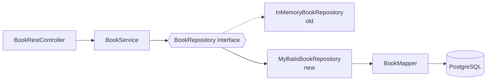

# Spring Boot + MyBatis — Step-by-Step Guide

## Table of Contents

- [Overview](#overview)
- [Step 1: What is MyBatis?](#step-1-what-is-mybatis)
- [Step 2: Why use MyBatis?](#step-2-why-use-mybatis)
- [Step 3: How MyBatis integrates with Spring Boot](#step-3-how-mybatis-integrates-with-spring-boot)
- [Step 4: Add the dependencies](#step-4-add-the-dependencies)
- [Step 5: Set up PostgreSQL and configure MyBatis](#step-5-set-up-postgresql-and-configure-mybatis)
- [Step 6: Create the Mapper (annotation-based)](#step-6-create-the-mapper-annotation-based)
- [Step 7: Plug the mapper into the existing layers](#step-7-plug-the-mapper-into-the-existing-layers)
- [Step 8: Run, test and watch the SQL](#step-8-run-test-and-watch-the-sql)
- [Step 9: The Advanced Book Search scenario](#step-9-the-advanced-book-search-scenario)
- [Step 10: XML-based mapping](#step-10-xml-based-mapping)
- [Step 11: Wire the search through the layers and test](#step-11-wire-the-search-through-the-layers-and-test)
- [Step 12: Annotation vs XML: decision guide](#step-12-annotation-vs-xml-decision-guide)
- [Appendix: MyBatis Quick Reference](#appendix-mybatis-quick-reference)
  - [A. MyBatis Annotations](#a-mybatis-annotations)
  - [B. MyBatis XML Elements](#b-mybatis-xml-elements)
  - [C. Common `mybatis.*` Properties](#c-common-mybatis-properties)
  - [D. Common Pitfalls](#d-common-pitfalls)

---

## Overview

In the previous guide (`03_SpringBootREST.md`) we built a Book REST API with the layers `rest` → `service` → `repo`. The data lived in an `ArrayList` inside `InMemoryBookRepository`, so **every restart lost all changes**.

In this guide we extend the **same application** so that books are stored in a real database, using **MyBatis** and **PostgreSQL**. We will:

1. Understand what MyBatis is, why it is used, and how it plugs into Spring Boot.
2. Replace the in-memory storage with a **PostgreSQL** database **without touching the controller or the service**.
3. Start with **annotation-based** mapping for simple CRUD.
4. Meet a realistic requirement (an advanced, filterable book search) where **XML-based mapping** is the better tool.

**What stays the same:** `Book`, `BookService`, `BookRestController`, `BookRepository` (interface), Swagger, exception handling.
**What is new:** a `BookMapper` interface, a `MyBatisBookRepository`, a database schema, and (in Step 10) a `BookMapper.xml` file.



**Project structure after this guide** (new/changed files are marked):

```
src/main/java/com/training/SpringBootDemo
├── constants/AppConstants.java
├── dto/BookSearchCriteria.java            <-- NEW (Step 9)
├── entity/Book.java
├── mapper/BookMapper.java                 <-- NEW (Step 6)
├── repo/BookRepository.java               <-- CHANGED (Step 9)
├── repo/InMemoryBookRepository.java
├── repo/MyBatisBookRepository.java        <-- NEW (Step 7)
├── rest/BookRestController.java           <-- CHANGED (Step 11)
└── service/BookService.java               <-- CHANGED (Step 11)
src/main/resources
├── application.properties                 <-- CHANGED (Step 5)
└── mapper/BookMapper.xml                  <-- NEW (Step 10)
db/                                        (project root, next to pom.xml)
├── schema.sql                             <-- NEW (Step 5)
└── data.sql                               <-- NEW (Step 5)
```

> **Prerequisites:** the Book REST application from `03_SpringBootREST.md` (Java 17+, Spring Boot 3.x, Maven) and PostgreSQL 14+ (installed locally or via Docker, see Step 5).

---

## Step 1: What is MyBatis?

1. **MyBatis** is a *SQL mapper* framework (a persistence framework) for Java. You write the **SQL yourself**, and MyBatis takes care of:

   - Setting the parameters of the SQL statement from your Java objects.
   - Executing the statement.
   - Converting each row of the `ResultSet` into Java objects.

   It removes the repetitive JDBC code (opening connections, `PreparedStatement`, `ResultSet` loops, closing resources) but does **not** hide SQL from you.

2. Compare plain JDBC with MyBatis for "find a book by id":

   **Plain JDBC**

   ```java
   public Book findBookById(int id) throws SQLException {
       String sql = "SELECT book_id, title, author, description, price FROM book WHERE book_id = ?";
       try (Connection con = dataSource.getConnection();
            PreparedStatement ps = con.prepareStatement(sql)) {
           ps.setInt(1, id);
           try (ResultSet rs = ps.executeQuery()) {
               if (rs.next()) {
                   Book b = new Book();
                   b.setBookid(rs.getInt("book_id"));
                   b.setTitle(rs.getString("title"));
                   b.setAuthor(rs.getString("author"));
                   b.setDesc(rs.getString("description"));
                   b.setPrice(rs.getDouble("price"));
                   return b;
               }
           }
       }
       return null;
   }
   ```

   **MyBatis**

   ```java
   @Select("SELECT book_id, title, author, description, price FROM book WHERE book_id = #{id}")
   Book findById(@Param("id") int id);
   ```

3. The main building blocks of MyBatis:

   | Concept | What it is |
   |---|---|
   | **Mapper interface** | A plain Java interface (e.g. `BookMapper`). Each method represents one SQL statement. You never write its implementation — MyBatis generates a proxy. |
   | **Mapped statement** | The SQL itself, defined either with **annotations** (`@Select`, `@Insert` …) or in an **XML mapper file**. |
   | **Parameter placeholders** | `#{name}` — value from your method parameter or object property, bound safely as a `PreparedStatement` parameter. |
   | **Result mapping** | Rules for turning result columns into object properties (auto-mapping, `@Results`, or `<resultMap>`). |
   | **SqlSessionFactory / SqlSession** | The factory and the unit of work that actually talk to the database. Spring Boot creates and manages these for you. |

4. How a call flows through MyBatis:

   ```mermaid
   sequenceDiagram
       participant Repo as MyBatisBookRepository
       participant Proxy as BookMapper (proxy)
       participant Session as SqlSessionTemplate
       participant DB as Database
       Repo->>Proxy: findById(1)
       Proxy->>Session: locate mapped statement "BookMapper.findById"
       Session->>DB: SELECT ... WHERE book_id = ?  (param = 1)
       DB-->>Session: ResultSet
       Session-->>Proxy: rows mapped to Book objects
       Proxy-->>Repo: Book
   ```

---

## Step 2: Why use MyBatis?

1. **Full control over SQL.** You write, tune and review exactly the SQL that runs. This matters for complex joins, reporting queries, database-specific functions, and legacy schemas.

2. **Works with existing databases.** Table and column names do not have to follow any naming convention or match your classes; you map them explicitly.

3. **Less boilerplate than JDBC**, with no need to model everything as entities/relations like a full ORM.

4. **SQL lives in a predictable place** — either right above the method (annotations) or in an XML file that a DBA can read and review without opening Java code.

5. **Powerful dynamic SQL** (`<if>`, `<where>`, `<foreach>` …) for queries whose shape changes depending on the input (see Step 9 and 10).

6. **Small learning curve** if you already know SQL.

**MyBatis vs. other options**

| | Plain JDBC / `JdbcTemplate` | **MyBatis** | JPA / Hibernate (Spring Data JPA) |
|---|---|---|---|
| Who writes SQL? | You | **You** | Framework (JPQL/derived queries; native SQL optional) |
| Object mapping | Manual (`RowMapper`) | **Declarative** (auto / `resultMap`) | Automatic via entity annotations |
| Schema/entity coupling | None | **Loose** | Tight (entity ⇄ table) |
| Dynamic SQL | String concatenation | **Built-in XML tags** | Criteria API / Specifications |
| Best suited for | Very small or simple needs | **SQL-centric apps, complex queries, legacy DBs** | Domain-driven CRUD-heavy apps |

**Trade-offs to be aware of:** you own the SQL (so also DB-portability and typos in SQL strings), there is no automatic schema generation, and relationships (joins to child objects) must be mapped by you.

---

## Step 3: How MyBatis integrates with Spring Boot

MyBatis on its own needs a lot of setup (building a `SqlSessionFactory`, managing sessions, transactions, closing resources). Two libraries remove that work:

- **MyBatis-Spring** — connects MyBatis to Spring's `DataSource`, transactions and exception translation.
- **`mybatis-spring-boot-starter`** — adds **auto-configuration** on top, so in a Spring Boot app there is almost no configuration to write.

1. When the starter is on the classpath and a `DataSource` exists, Spring Boot automatically:

   | Auto-configured piece | What it does |
   |---|---|
   | `SqlSessionFactory` | Built from the Spring `DataSource`; reads the `mybatis.*` properties and any XML mapper files. |
   | `SqlSessionTemplate` | A thread-safe `SqlSession` managed by Spring. It joins Spring transactions (e.g. `@Transactional`) and closes itself. |
   | **Mapper scanning** | Finds interfaces annotated with `@Mapper` under the package of your `@SpringBootApplication` class and registers each as a **Spring bean** (a proxy). |
   | Exception translation | MyBatis exceptions are translated to Spring's `DataAccessException` hierarchy. |

2. Because each mapper is a Spring bean, you can inject it exactly like any other dependency:

   ```java
   public MyBatisBookRepository(BookMapper bookMapper) {
       this.bookMapper = bookMapper;
   }
   ```

3. What ties everything together:

   ```mermaid
   flowchart TD
       P[application.properties<br/>datasource + mybatis.*] --> DS[DataSource<br/>HikariCP]
       DS --> SF[SqlSessionFactory]
       X[Mapper XML files<br/>classpath:mapper/*.xml] --> SF
       A[@Mapper interfaces<br/>annotation SQL] --> SF
       SF --> ST[SqlSessionTemplate]
       ST --> MB[BookMapper bean<br/>proxy]
       MB --> RP[MyBatisBookRepository]
   ```

4. **`@Mapper` vs `@MapperScan`**

   - `@Mapper` on each interface — simplest; scanned automatically (used in this guide).
   - `@MapperScan("com.training.SpringBootDemo.mapper")` on a configuration class — scans a whole package, so `@Mapper` is not needed on each interface.

---

## Step 4: Add the dependencies

1. Add the following to the `pom.xml` of the existing project:

   ```xml
   <dependency>
       <groupId>org.mybatis.spring.boot</groupId>
       <artifactId>mybatis-spring-boot-starter</artifactId>
       <version>3.0.5</version>
   </dependency>

   <dependency>
       <groupId>org.postgresql</groupId>
       <artifactId>postgresql</artifactId>
       <scope>runtime</scope>
   </dependency>
   ```

   - `mybatis-spring-boot-starter` also brings in `spring-boot-starter-jdbc` (connection pool, transactions), MyBatis and MyBatis-Spring.
   - `org.postgresql:postgresql` is the PostgreSQL JDBC driver. Its version is managed by Spring Boot, so no `<version>` is needed. To use another database later (MySQL, Oracle …), only this driver and the URL in Step 5 change; the mapper and repository code stays the same (apart from any database-specific SQL).

2. **Pick the starter version that matches your Spring Boot version:**

   | Spring Boot | `mybatis-spring-boot-starter` |
   |---|---|
   | 3.2 – 3.5 | `3.0.x` (this guide uses `3.0.5`) |
   | 4.0 | `4.0.x` |
   | 4.1 | `4.1.x` |

   The Book application uses `springdoc-openapi 2.6.0`, i.e. Spring Boot 3.x, hence `3.0.5`.

3. Reload Maven (click the reload prompt in `pom.xml`, as done in Step 1 of the REST guide).

---

## Step 5: Set up PostgreSQL and configure MyBatis

### 5.1 Install PostgreSQL and open `psql`

1. Install PostgreSQL 14 or later (<https://www.postgresql.org/download/>), or run it in Docker:

   ```bash
   docker run --name bookdb-pg -e POSTGRES_PASSWORD=postgres -p 5432:5432 -d postgres:16
   ```

2. `psql` is PostgreSQL's command-line client. Check that it works:

   ```bash
   psql --version
   ```

   > **Windows:** if the command is not found, add the PostgreSQL `bin` folder (for example `C:\Program Files\PostgreSQL\16\bin`) to your `PATH`, or run `psql` from that folder. **Docker:** use `docker exec -it bookdb-pg psql -U postgres` in place of `psql -U postgres` in the commands below.

### 5.2 Create the database and an application user

Connect as the administrator (`postgres`) and create a dedicated user and database for the application:

```bash
psql -U postgres -h localhost
```

```sql
CREATE USER bookuser WITH PASSWORD 'bookpass';
CREATE DATABASE bookdb OWNER bookuser;
\q
```

> Using a separate user that **owns** the database (instead of `postgres`) is good practice, and it avoids "permission denied for table book" errors later.

### 5.3 Create the SQL scripts

Create a folder **`db`** at the root of the project (next to `pom.xml`, **not** inside `src/main/resources`) with the two files below. We keep them outside `resources` on purpose: we will run them ourselves with `psql`, and Spring Boot must not run them automatically.

1. **`db/schema.sql`**

   ```sql
   DROP TABLE IF EXISTS book;

   CREATE TABLE book (
       book_id     INT GENERATED ALWAYS AS IDENTITY PRIMARY KEY,
       title       VARCHAR(100)  NOT NULL,
       author      VARCHAR(100)  NOT NULL,
       description VARCHAR(255),
       price       NUMERIC(10,2) NOT NULL
   );
   ```

   > Notice that the column names are **not identical** to the fields of the `Book` class: `book_id` vs `bookid`, and `description` vs `desc`. (`DESC` is a reserved word in SQL, so it is a poor column name.) This is a very typical real-world situation, and we will solve it with explicit result mapping in Step 6.
   >
   > `GENERATED ALWAYS AS IDENTITY` is PostgreSQL's auto-increment column (backed by a sequence). Older guides use `SERIAL`, which behaves the same way for our purpose.

2. **`db/data.sql`** — the same four books that `InMemoryBookRepository` had:

   ```sql
   INSERT INTO book (title, author, description, price) VALUES ('Core Java', 'Hotsmann', 'Learn java fundamentals', 130.0);
   INSERT INTO book (title, author, description, price) VALUES ('HTML', 'Kelly', 'Learn html for UI', 230.0);
   INSERT INTO book (title, author, description, price) VALUES ('python', 'ryan', 'Learn python fundamentals', 130.0);
   INSERT INTO book (title, author, description, price) VALUES ('css', 'kelly', 'Learn css for designing webpage', 130.0);
   ```

   > We do **not** insert `book_id` ourselves; the database generates 1–4. (If you insert explicit ids into an identity column, the sequence is not advanced and later inserts can clash with them.)

### 5.4 Load the scripts using `psql`

There are three common ways. Run them from the **project root**, connecting as `bookuser` (password `bookpass`).

1. **Option A — run a script file with `-f` (simplest, one command per file):**

   ```bash
   psql -U bookuser -h localhost -d bookdb -f db/schema.sql
   psql -U bookuser -h localhost -d bookdb -f db/data.sql
   ```

   | Flag | Meaning |
   |---|---|
   | `-U` | Database user |
   | `-h` | Host (`localhost`) |
   | `-d` | Database name |
   | `-f` | File of SQL commands to execute |

   You should see `DROP TABLE`, `CREATE TABLE` and `INSERT 0 1` (four times).

2. **Option B — interactively, with `\i`:**

   ```bash
   psql -U bookuser -h localhost -d bookdb
   ```

   ```sql
   bookdb=> \i db/schema.sql
   bookdb=> \i db/data.sql
   bookdb=> \dt
   bookdb=> SELECT * FROM book;
   bookdb=> \q
   ```

   > `\i` reads the path relative to the folder where you **started** `psql`. Use an absolute path if unsure; on Windows use forward slashes, e.g. `\i 'C:/projects/SpringBootDemo/db/schema.sql'`.

3. **Option C — Docker container (the files are on your machine, not in the container):**

   ```bash
   docker cp db/schema.sql bookdb-pg:/tmp/schema.sql
   docker cp db/data.sql   bookdb-pg:/tmp/data.sql
   docker exec bookdb-pg psql -U bookuser -d bookdb -f /tmp/schema.sql
   docker exec bookdb-pg psql -U bookuser -d bookdb -f /tmp/data.sql
   ```

   (This assumes you created the user and database in 5.2 through `docker exec -it bookdb-pg psql -U postgres`.)

4. **Useful `psql` commands to verify the result:**

   | Command | Purpose |
   |---|---|
   | `\dt` | List tables in the current database |
   | `\d book` | Describe the `book` table (columns, types, identity) |
   | `SELECT * FROM book;` | Show the rows |
   | `\c bookdb` | Connect to another database |
   | `\l` | List databases |
   | `\q` | Quit |

   > Running `schema.sql` again **drops and recreates** the table, so it also acts as a "reset" for your test data. Run `data.sql` afterwards to reload the four books.

### 5.5 Configure `application.properties`

Add the following:

```properties
# ---------- Database (PostgreSQL) ----------
spring.datasource.url=jdbc:postgresql://localhost:5432/bookdb
spring.datasource.username=bookuser
spring.datasource.password=${DB_PASSWORD:bookpass}
spring.datasource.driver-class-name=org.postgresql.Driver

# The tables are created with psql (Step 5.4), so Spring must not run any SQL scripts
spring.sql.init.mode=never

# ---------- MyBatis ----------
# Where the XML mapper files live (used from Step 10 onwards)
mybatis.mapper-locations=classpath:mapper/*.xml

# Print the SQL executed by our mapper (uses the logging setup from Step 11 of the REST guide)
logging.level.com.training.SpringBootDemo.mapper=debug
```

| Property | Meaning |
|---|---|
| `spring.datasource.url` | `jdbc:postgresql://<host>:<port>/<database>` — default PostgreSQL port is `5432`. |
| `spring.datasource.username` / `password` | The user created in 5.2. `${DB_PASSWORD:bookpass}` reads the environment variable `DB_PASSWORD` and falls back to `bookpass` for local development, so the real password never has to be committed. |
| `spring.datasource.driver-class-name` | Optional (Spring Boot detects it from the URL), shown for clarity. |
| `spring.sql.init.mode=never` | Spring Boot does **not** execute `schema.sql`/`data.sql`. (For a non-embedded database such as PostgreSQL this is already the default.) |

> **Alternative — let Spring Boot run the scripts at every startup** (handy for demos, dangerous for real data because `schema.sql` drops the table): keep the two files in `db/` and use
>
> ```properties
> spring.sql.init.mode=always
> spring.sql.init.schema-locations=file:db/schema.sql
> spring.sql.init.data-locations=file:db/data.sql
> ```
>
> instead of `spring.sql.init.mode=never`.

---

## Step 6: Create the Mapper (annotation-based)

1. Create the interface below. Each method is one SQL statement:

   ```java
   package com.training.SpringBootDemo.mapper;

   import com.training.SpringBootDemo.entity.Book;
   import org.apache.ibatis.annotations.*;

   import java.util.List;

   @Mapper
   public interface BookMapper {

       @Results(id = "bookResultMap", value = {
           @Result(column = "book_id",     property = "bookid", id = true),
           @Result(column = "title",       property = "title"),
           @Result(column = "author",      property = "author"),
           @Result(column = "description", property = "desc"),
           @Result(column = "price",       property = "price")
       })
       @Select("SELECT book_id, title, author, description, price FROM book")
       List<Book> findAll();

       @Select("SELECT COUNT(*) FROM book")
       long count();

       @ResultMap("bookResultMap")
       @Select("SELECT book_id, title, author, description, price FROM book WHERE book_id = #{id}")
       Book findById(@Param("id") int id);

       @ResultMap("bookResultMap")
       @Select("SELECT book_id, title, author, description, price FROM book " +
               "WHERE LOWER(author) = LOWER(#{author})")
       List<Book> findAllByAuthor(@Param("author") String author);

       @Insert("INSERT INTO book (title, author, description, price) " +
               "VALUES (#{title}, #{author}, #{desc}, #{price})")
       @Options(useGeneratedKeys = true, keyProperty = "bookid", keyColumn = "book_id")
       int insert(Book book);

       @Update("UPDATE book SET title = #{title}, author = #{author}, " +
               "description = #{desc}, price = #{price} WHERE book_id = #{bookid}")
       int update(Book book);

       @Delete("DELETE FROM book WHERE book_id = #{id}")
       int deleteById(@Param("id") int id);
   }
   ```

   > Package: `com.training.SpringBootDemo.**mapper**`

2. Understand each part:

   | Element | Meaning |
   |---|---|
   | `@Mapper` | Registers the interface as a MyBatis mapper and a Spring bean (Step 3). |
   | `@Select`, `@Insert`, `@Update`, `@Delete` | The SQL for the method. |
   | `#{id}` | Parameter placeholder — becomes a `?` in a `PreparedStatement`, so it is **safe against SQL injection**. |
   | `@Param("id")` | Gives a method parameter a name that can be used in `#{...}`. Needed when there is more than one parameter (recommended always). |
   | `#{title}`, `#{desc}` … | When the parameter is an object (`Book`), `#{title}` reads `book.getTitle()`, and so on. |
   | `@Results` / `@Result` | Maps result **columns → Java properties** explicitly. Needed here because `book_id ≠ bookid` and `description ≠ desc`. Without it those fields would come back `null`. |
   | `@Results(id = "bookResultMap")` + `@ResultMap("bookResultMap")` | Define the mapping once and **reuse** it in other methods. |
   | `@Options(useGeneratedKeys = true, keyProperty = "bookid", keyColumn = "book_id")` | After the `INSERT`, copy the database-generated id back into `book.bookid`. |
   | Return type `int` on insert/update/delete | The number of **rows affected**. We use it to detect "not found". |
   | `LOWER(author) = LOWER(#{author})` | Keeps the same *case-insensitive* behaviour as `equalsIgnoreCase` in the in-memory version. |

---

## Step 7: Plug the mapper into the existing layers

Because the service depends on the `BookRepository` **interface**, we only need to provide a new implementation of it.

1. Create `MyBatisBookRepository`:

   ```java
   package com.training.SpringBootDemo.repo;

   import com.training.SpringBootDemo.entity.Book;
   import com.training.SpringBootDemo.mapper.BookMapper;
   import org.springframework.context.annotation.Primary;
   import org.springframework.stereotype.Repository;

   import java.util.List;

   @Repository
   @Primary
   public class MyBatisBookRepository implements BookRepository {

       private final BookMapper bookMapper;

       public MyBatisBookRepository(BookMapper bookMapper) {
           this.bookMapper = bookMapper;
       }

       @Override
       public long count() {
           return bookMapper.count();
       }

       @Override
       public List<Book> findAll() {
           return bookMapper.findAll();
       }

       @Override
       public Book save(Book book) {
           if (book.getBookid() > 0 && bookMapper.findById(book.getBookid()) != null) {
               throw new RuntimeException("Book with id " + book.getBookid() + " already exists");
           }
           bookMapper.insert(book);      // the generated id is set on 'book'
           return book;
       }

       @Override
       public Book update(Book book) {
           if (bookMapper.update(book) == 0) {
               throw new RuntimeException("Book with id " + book.getBookid() + " does not exist");
           }
           return book;
       }

       @Override
       public List<Book> findAllByAuthor(String author) {
           return bookMapper.findAllByAuthor(author);
       }

       @Override
       public void delete(int id) {
           if (bookMapper.deleteById(id) == 0) {
               throw new RuntimeException("Book with id " + id + " does not exist");
           }
       }

       @Override
       public Book findBookById(int id) {
           Book book = bookMapper.findById(id);
           if (book == null) {
               throw new RuntimeException("Book with id " + id + " does not exists");
           }
           return book;
       }
   }
   ```

   > Package: `com.training.SpringBootDemo.**repo**`

2. **Why `@Primary`?** Now there are **two** beans of type `BookRepository` (`InMemoryBookRepository` and `MyBatisBookRepository`). Without help, Spring cannot decide which one to inject into `BookService` and fails at startup with `NoUniqueBeanDefinitionException`. `@Primary` marks the MyBatis one as the default.

   > Alternatively, remove `@Repository` from `InMemoryBookRepository`, or use `@Qualifier` in the service constructor. Keeping both makes it easy to switch back to the in-memory version by moving `@Primary`.

3. The error behaviour is intentionally the **same as before** (a `RuntimeException` for "not found" / "already exists"), so the exception handling from Step 9 of the REST guide keeps working unchanged.

4. `BookService` and `BookRestController` need **no change at all**. This is the benefit of coding to an interface and keeping the layers separate.

---

## Step 8: Run, test and watch the SQL

1. <mark>**MAKE SURE TO RESTART THE SERVER**</mark>. Make sure PostgreSQL is running and the scripts from Step 5.4 were loaded. In the console you should see the connection pool start (HikariPool) and no errors about mappers or the database connection.

2. Test with the same curl commands as before (use your port):

   ```bash
   # all books
   curl http://localhost:8081/books

   # one book
   curl http://localhost:8081/books/1

   # by author -> returns BOTH 'Kelly' and 'kelly' (case-insensitive)
   curl "http://localhost:8081/books?author=kelly"

   # add a book
   curl -si -X POST http://localhost:8081/books -H 'accept: */*' -H 'Content-Type: application/json' \
   -d '{"title": "AWS", "author": "ryan","desc": "Learn aws fundamentals","price": 530.0}'

   # update
   curl -si -X PUT http://localhost:8081/books -H 'accept: */*' -H 'Content-Type: application/json' \
   -d '{"author":"Cay Hotsmann","bookid":1,"desc":"Learn java fundamentals and become an expert","price":130.0,"title":"Core Java"}'

   # delete
   curl -si -X DELETE http://localhost:8081/books/2

   # not found -> handled by your exception handler as before
   curl -i http://localhost:8081/books/99
   ```

3. Because of `logging.level.com.training.SpringBootDemo.mapper=debug`, the console shows the SQL for every request:

   ```
   ==>  Preparing: SELECT book_id, title, author, description, price FROM book WHERE LOWER(author) = LOWER(?)
   ==> Parameters: kelly(String)
   <==      Total: 2
   ```

   - `==>` is the statement sent, with `?` placeholders (this is `#{...}` at work).
   - `Parameters` shows the bound values and their types.
   - `Total` is the number of rows returned.

4. **The real proof of persistence:** the data is now stored in PostgreSQL instead of a Java list. Open `psql` and look at the rows after your POST/PUT/DELETE calls:

   ```bash
   psql -U bookuser -h localhost -d bookdb -c "SELECT * FROM book ORDER BY book_id;"
   ```

   Now **stop and restart** the Spring Boot application and call `GET /books` again. Your changes are still there. This was not possible with `InMemoryBookRepository`.

   > Identity values are never reused: if you delete book 4 and add a new one, the new book gets id 5. Also, after re-running `db/schema.sql` the ids start from 1 again.

---

## Step 9: The Advanced Book Search scenario

Up to now every query had a **fixed** shape, which annotations handle perfectly. Now a new requirement arrives:

> **Requirement:** Provide a `GET /books/search` endpoint. Every filter is **optional** and can be combined freely:
> - `keyword` — text found in the title **or** description
> - `author`
> - `minPrice` and `maxPrice`
> - `ids` — only books with any of these ids
> - `sortBy` (`title`, `author`, `price`) and `sortDir` (`asc`, `desc`)

The final SQL depends on **which filters the caller supplied** — that is *dynamic SQL*. A few of the many possible shapes:

| Request | SQL needed |
|---|---|
| `?author=kelly` | `... WHERE LOWER(author) = LOWER(?) ORDER BY title` |
| `?author=kelly&maxPrice=200` | `... WHERE LOWER(author) = LOWER(?) AND price <= ? ORDER BY title` |
| `?ids=1,3&sortBy=price&sortDir=desc` | `... WHERE book_id IN (?, ?) ORDER BY price DESC` |
| *(no filters)* | `... ORDER BY title` |

With 5 optional filters and a variable-length id list there are dozens of combinations. You cannot write one fixed `@Select` string for this.

1. **First attempt — annotations.** MyBatis does allow dynamic SQL inside an annotation by wrapping the SQL in a `<script>` element. Here is a *reduced* version (only two filters!) — for comparison only, **do not add it to your project**:

   ```java
   @ResultMap("bookResultMap")
   @Select({
       "<script>",
       "SELECT book_id, title, author, description, price FROM book",
       "<where>",
       "  <if test='author != null and author != \"\"'>",
       "    AND LOWER(author) = LOWER(#{author})",
       "  </if>",
       "  <if test='maxPrice != null'>",
       "    AND price &lt;= #{maxPrice}",
       "  </if>",
       "</where>",
       "</script>"
   })
   List<Book> searchWithAnnotations(BookSearchCriteria criteria);
   ```

2. What is wrong with this approach?

   - **XML inside Java strings**: quotes must be escaped (`\"`), and `<`, `>` and `&` must be written as `&lt;`, `&gt;`, `&amp;`.
   - **No tooling**: the IDE treats it as an ordinary string — no syntax highlighting, no tag auto-completion, no validation. A typo in a tag is found only at runtime when the application starts.
   - **Hard to read and review** once `keyword`, `ids` (`<foreach>`) and sorting (`<choose>`) are added — the method grows into 40+ string lines.
   - **No reuse**: the column list and conditions cannot be shared with other statements.
   - The alternative, `@SelectProvider`, moves the SQL into Java code that builds the string manually — it works, but you lose the declarative style.

**This is exactly the situation where XML-based mapping is the better choice.**

---

## Step 10: XML-based mapping

An XML mapper keeps SQL out of Java and gives you the full dynamic-SQL tag set with proper editor support.

1. **Move the result mapping to XML** (so annotation methods and XML statements share it). In `BookMapper.java`, remove the `@Results(...)` block from `findAll()` and reference the XML mapping instead:

   ```java
   @ResultMap("bookResultMap")
   @Select("SELECT book_id, title, author, description, price FROM book")
   List<Book> findAll();
   ```

   The other methods already use `@ResultMap("bookResultMap")` and stay as they are.

2. **Declare the new method** in `BookMapper.java`. Notice: **no SQL annotation** — the SQL comes from the XML file.

   ```java
   import com.training.SpringBootDemo.dto.BookSearchCriteria;

   // ...

   List<Book> search(BookSearchCriteria criteria);
   ```

3. **Create the criteria class** that carries the optional filters:

   ```java
   package com.training.SpringBootDemo.dto;

   import java.util.List;

   public class BookSearchCriteria {

       private String keyword;
       private String author;
       private Double minPrice;
       private Double maxPrice;
       private List<Integer> ids;
       private String sortBy;
       private String sortDir;

       public String getKeyword() { return keyword; }
       public void setKeyword(String keyword) { this.keyword = keyword; }

       public String getAuthor() { return author; }
       public void setAuthor(String author) { this.author = author; }

       public Double getMinPrice() { return minPrice; }
       public void setMinPrice(Double minPrice) { this.minPrice = minPrice; }

       public Double getMaxPrice() { return maxPrice; }
       public void setMaxPrice(Double maxPrice) { this.maxPrice = maxPrice; }

       public List<Integer> getIds() { return ids; }
       public void setIds(List<Integer> ids) { this.ids = ids; }

       public String getSortBy() { return sortBy; }
       public void setSortBy(String sortBy) { this.sortBy = sortBy; }

       public String getSortDir() { return sortDir; }
       public void setSortDir(String sortDir) { this.sortDir = sortDir; }
   }
   ```

   > Package: `com.training.SpringBootDemo.**dto**`. Use wrapper types (`Double`, not `double`) so that "not supplied" can be represented as `null`.

4. **Create the XML mapper** `src/main/resources/mapper/BookMapper.xml`:

   ```xml
   <?xml version="1.0" encoding="UTF-8" ?>
   <!DOCTYPE mapper PUBLIC "-//mybatis.org//DTD Mapper 3.0//EN"
           "https://mybatis.org/dtd/mybatis-3-mapper.dtd">

   <mapper namespace="com.training.SpringBootDemo.mapper.BookMapper">

       <!-- Shared result mapping: used by XML statements AND by @ResultMap in the interface -->
       <resultMap id="bookResultMap" type="com.training.SpringBootDemo.entity.Book">
           <id     column="book_id"     property="bookid"/>
           <result column="title"       property="title"/>
           <result column="author"      property="author"/>
           <result column="description" property="desc"/>
           <result column="price"       property="price"/>
       </resultMap>

       <!-- Reusable SQL fragment -->
       <sql id="bookColumns">book_id, title, author, description, price</sql>

       <select id="search"
               parameterType="com.training.SpringBootDemo.dto.BookSearchCriteria"
               resultMap="bookResultMap">
           SELECT <include refid="bookColumns"/>
           FROM book
           <where>
               <if test="keyword != null and keyword != ''">
                   AND (LOWER(title) LIKE CONCAT('%', LOWER(#{keyword}), '%')
                     OR LOWER(description) LIKE CONCAT('%', LOWER(#{keyword}), '%'))
               </if>
               <if test="author != null and author != ''">
                   AND LOWER(author) = LOWER(#{author})
               </if>
               <if test="minPrice != null">
                   AND price &gt;= #{minPrice}
               </if>
               <if test="maxPrice != null">
                   AND price &lt;= #{maxPrice}
               </if>
               <if test="ids != null and ids.size() > 0">
                   AND book_id IN
                   <foreach collection="ids" item="bookId" open="(" separator="," close=")">
                       #{bookId}
                   </foreach>
               </if>
           </where>
           <choose>
               <when test="sortBy == 'price'">ORDER BY price</when>
               <when test="sortBy == 'author'">ORDER BY author</when>
               <otherwise>ORDER BY title</otherwise>
           </choose>
           <if test="sortDir == 'desc'"> DESC</if>
       </select>

   </mapper>
   ```

5. **The rules that connect the XML to the interface:**

   | Rule | In this guide |
   |---|---|
   | `namespace` = **fully-qualified name of the mapper interface** | `com.training.SpringBootDemo.mapper.BookMapper` |
   | statement `id` = **method name** | `<select id="search">` ↔ `search(...)` |
   | XML file must be found by `mybatis.mapper-locations` | `classpath:mapper/*.xml` (Step 5) |
   | A method uses **either** an annotation **or** an XML statement, never both | `search` has no annotation |

   > Annotation-based and XML-based statements can live in the **same** mapper interface — MyBatis merges them. You do not have to choose one style for the whole project.

6. **What each dynamic tag does:**

   | Tag | Purpose in this query |
   |---|---|
   | `<where>` | Adds `WHERE` only if at least one condition is inside, and **removes the leading `AND`** from the first condition. |
   | `<if test="...">` | Includes the SQL fragment only when the OGNL expression is true (here: when the filter was supplied). |
   | `<foreach>` | Loops over the `ids` list and produces `(?, ?, ?)` for the `IN` clause. |
   | `<choose>/<when>/<otherwise>` | A `switch`: picks exactly one `ORDER BY`. |
   | `<sql>` + `<include>` | Defines a fragment once and reuses it anywhere in the file. |
   | `<resultMap>` | Declares the column → property mapping once. |
   | `&gt;` / `&lt;` | `>` and `<` written as XML entities (or wrap the SQL in `<![CDATA[ ... ]]>`). |

7. **Important — `#{}` vs `${}`:**

   - `#{value}` → bound as a `PreparedStatement` parameter (`?`). **Always use this for data.**
   - `${value}` → pasted **as text** into the SQL. It is open to SQL injection.

   The sort column cannot be a `#{}` parameter, and using `ORDER BY ${sortBy}` would let a caller inject SQL. That is why `sortBy` is handled with `<choose>`, which only ever emits **whitelisted** column names.

---

## Step 11: Wire the search through the layers and test

1. **Repository interface** — add the method to `BookRepository`. A `default` implementation keeps `InMemoryBookRepository` compiling without any change:

   ```java
   import com.training.SpringBootDemo.dto.BookSearchCriteria;

   public interface BookRepository {
       // ... existing methods ...

       default List<Book> search(BookSearchCriteria criteria) {
           throw new UnsupportedOperationException("Search is supported only by the database repository");
       }
   }
   ```

2. **MyBatis repository** — override it in `MyBatisBookRepository`:

   ```java
   @Override
   public List<Book> search(BookSearchCriteria criteria) {
       return bookMapper.search(criteria);
   }
   ```

3. **Service** — add to `BookService`:

   ```java
   public List<Book> searchBooks(BookSearchCriteria criteria) {
       return repository.search(criteria);
   }
   ```

4. **Controller** — add to `BookRestController`:

   ```java
   @GetMapping("/search")
   public ResponseEntity<Object> searchBooks(
           @RequestParam(required = false) String keyword,
           @RequestParam(required = false) String author,
           @RequestParam(required = false) Double minPrice,
           @RequestParam(required = false) Double maxPrice,
           @RequestParam(required = false) List<Integer> ids,
           @RequestParam(required = false) String sortBy,
           @RequestParam(required = false, defaultValue = "asc") String sortDir) {

       BookSearchCriteria criteria = new BookSearchCriteria();
       criteria.setKeyword(keyword);
       criteria.setAuthor(author);
       criteria.setMinPrice(minPrice);
       criteria.setMaxPrice(maxPrice);
       criteria.setIds(ids);
       criteria.setSortBy(sortBy);
       criteria.setSortDir(sortDir.toLowerCase());

       Map<String, Object> map = new HashMap<>();
       map.put(AppConstants.STATUS, AppConstants.SUCCESS);
       map.put("books", bookService.searchBooks(criteria));
       return ResponseEntity.ok(map);
   }
   ```

   > `/books/search` does not clash with `/books/{id}`: Spring prefers the literal path over the path variable. Each `@RequestParam` is optional (`required = false`), as learned in Step 5 of the REST guide.

5. <mark>**MAKE SURE TO RESTART THE SERVER**</mark> (XML files are loaded only at startup) and test:

   ```bash
   # keyword in title or description -> all 4 books (every description contains "Learn")
   curl "http://localhost:8081/books/search?keyword=learn"

   # author + price cap -> only 'css' (HTML by Kelly costs 230)
   curl "http://localhost:8081/books/search?author=kelly&maxPrice=200"

   # price floor, most expensive first -> 'HTML' (230) comes first
   curl "http://localhost:8081/books/search?minPrice=100&sortBy=price&sortDir=desc"

   # specific ids -> 'Core Java' and 'python'
   curl "http://localhost:8081/books/search?ids=1,3"

   # no filters at all -> everything, sorted by title
   curl "http://localhost:8081/books/search"
   ```

6. **Watch the SQL change with the input** in the console — the same mapper method produces a different statement each time:

   ```
   # ?author=kelly&maxPrice=200
   ==>  Preparing: SELECT book_id, title, author, description, price FROM book WHERE LOWER(author) = LOWER(?) AND price <= ? ORDER BY title
   ==> Parameters: kelly(String), 200.0(Double)

   # ?ids=1,3&sortBy=price&sortDir=desc
   ==>  Preparing: SELECT book_id, title, author, description, price FROM book WHERE book_id IN ( ? , ? ) ORDER BY price DESC
   ==> Parameters: 1(Integer), 3(Integer)
   ```

---

## Step 12: Annotation vs XML: decision guide

1. **Use annotation-based mapping when…**

   - The SQL is **short and static** (simple CRUD, `COUNT`, lookups by key).
   - You want the SQL **next to the method** so you can read the whole behaviour in one place.
   - The project is small or a prototype.

2. **Use XML-based mapping when…**

   | Situation | Why XML wins |
   |---|---|
   | **Dynamic SQL** — optional filters, variable `IN` lists, conditional sorting (the scenario in Step 9) | `<if>`, `<where>`, `<foreach>`, `<choose>`, `<set>`, `<trim>` are readable XML instead of escaped strings inside Java. |
   | **Long or complex SQL** — multi-table joins, reports, CTEs, vendor-specific functions | Multi-line SQL with proper formatting; no `"..." +` concatenation. |
   | **Nested / one-to-many mappings** — e.g. a `Book` with a list of `Review`s | `<resultMap>` with `<association>` and `<collection>` is far clearer than `@One`/`@Many`. |
   | **Reuse across statements** | `<sql>`/`<include>` fragments and shared `<resultMap>`s. |
   | **SQL owned/reviewed by DBAs** | They can edit and tune `.xml` files without touching Java code. |
   | **Tooling** | IDEs validate the XML against the DTD and can link mapper methods to XML statements. |
   | **Change SQL without touching Java** | SQL changes stay in resource files (still needs a restart or rebuild). |

3. **Both together (recommended for most projects):** keep trivial statements as annotations and put complex or dynamic ones into XML — both in the same interface, as done in this guide.

4. **One more XML-only advantage — partial updates.** With `<set>`, only the supplied fields are updated (useful for a `PATCH` endpoint). *Illustration only, not part of the application:*

   ```xml
   <update id="updateSelective">
       UPDATE book
       <set>
           <if test="title != null">title = #{title},</if>
           <if test="author != null">author = #{author},</if>
           <if test="desc != null">description = #{desc},</if>
           <if test="price != null">price = #{price},</if>
       </set>
       WHERE book_id = #{bookid}
   </update>
   ```

   `<set>` adds the `SET` keyword and strips the trailing comma automatically.

---

## Appendix: MyBatis Quick Reference

### A. MyBatis Annotations

| Annotation | Applied To | Purpose |
|---|---|---|
| `@Mapper` | Interface | Marks the interface as a MyBatis mapper; Spring Boot registers it as a bean. |
| `@MapperScan` | Configuration class | Scans a package for mapper interfaces (alternative to `@Mapper` on each). |
| `@Select` | Method | SQL `SELECT` statement. |
| `@Insert` | Method | SQL `INSERT` statement. |
| `@Update` | Method | SQL `UPDATE` statement. |
| `@Delete` | Method | SQL `DELETE` statement. |
| `@Param` | Method parameter | Names a parameter so it can be used as `#{name}`. |
| `@Results` / `@Result` | Method | Explicit column → property mapping; `id = "..."` makes it reusable. |
| `@ResultMap` | Method | Reuses a result mapping defined with `@Results(id=...)` or in XML `<resultMap>`. |
| `@Options` | Method | Extra options, e.g. `useGeneratedKeys`, `keyProperty`, `timeout`, `fetchSize`. |
| `@SelectProvider` / `@InsertProvider` / `@UpdateProvider` / `@DeleteProvider` | Method | Builds the SQL in Java code (a class with a method returning the SQL string) — annotation-style dynamic SQL. |
| `@One` / `@Many` | Inside `@Result` | Nested mapping for one-to-one / one-to-many relations. |

### B. MyBatis XML Elements

| Element | Purpose |
|---|---|
| `<mapper namespace="...">` | Root element; namespace = fully-qualified mapper interface name. |
| `<select>`, `<insert>`, `<update>`, `<delete>` | The SQL statements; `id` = method name. |
| `<resultMap>` with `<id>`, `<result>` | Column → property mapping. |
| `<association>` / `<collection>` | Nested object / nested list mapping (joins). |
| `<sql>` and `<include refid="...">` | Reusable SQL fragment. |
| `<if test="...">` | Conditional SQL. |
| `<choose>`, `<when>`, `<otherwise>` | `switch`-style conditional SQL. |
| `<where>` | Adds `WHERE` if needed and strips a leading `AND`/`OR`. |
| `<set>` | Adds `SET` for updates and strips the trailing comma. |
| `<trim>` | Generic prefix/suffix adder and remover (`<where>`/`<set>` are special cases). |
| `<foreach>` | Iterates over a collection (`IN` lists, batch inserts). |
| `<bind>` | Creates a variable from an expression, e.g. `<bind name="pattern" value="'%' + keyword + '%'"/>`. |

### C. Common `mybatis.*` Properties

| Property | Purpose |
|---|---|
| `mybatis.mapper-locations` | Location of XML mapper files, e.g. `classpath:mapper/*.xml`. |
| `mybatis.type-aliases-package` | Package scanned for short class aliases (lets you write `type="Book"` instead of the full class name). |
| `mybatis.configuration.map-underscore-to-camel-case` | Auto-maps `first_name` → `firstName` for columns/properties that follow that pattern. |
| `mybatis.configuration.default-fetch-size` | Default JDBC fetch size. |
| `mybatis.configuration.log-impl` | Choose the logging implementation (e.g. `org.apache.ibatis.logging.stdout.StdOutImpl`). |
| `logging.level.<mapper package>=debug` | Prints executed SQL through the normal Spring Boot logging (used in this guide). |

### D. Common Pitfalls

1. **`BindingException: Invalid bound statement (not found)`** — the XML `namespace` does not equal the interface's fully-qualified name, the statement `id` does not match the method name, or `mybatis.mapper-locations` is missing/wrong.
2. **Fields come back `null`** — column names do not match property names and no `@Results`/`<resultMap>` was defined (`book_id` / `description` in this guide).
3. **`NoUniqueBeanDefinitionException` for `BookRepository`** — two implementations exist; add `@Primary` or `@Qualifier`.
4. **XML errors when the SQL contains `<`, `>` or `&`** — write `&lt;`, `&gt;`, `&amp;` or use `<![CDATA[ ... ]]>`.
5. **SQL injection through `${}`** — use `#{}` for values; whitelist anything that must be pasted (like column names) with `<choose>`.
6. **XML changes not visible** — mapper XML is read at startup; restart the application.
7. **Method overloading** — XML statements are matched by method *name*, so two overloaded methods cannot map to different XML statements. Use distinct method names.
8. **Wrong starter version** — use `3.0.x` for Spring Boot 3.2–3.5, `4.x` for Spring Boot 4 (see Step 4).
9. **Reserved words as column names** (`desc`, `order`, `user`) — avoid them, or quote them; that is why the column is `description`.
10. **`Connection refused` / `password authentication failed for user "bookuser"`** — PostgreSQL is not running, the port/host in `spring.datasource.url` is wrong, or the user/password differs from what you created in Step 5.2.
11. **`relation "book" does not exist`** — the scripts were not loaded into the **same database** the application connects to. Check with `psql -U bookuser -d bookdb -c "\dt"`.
12. **`permission denied for table book`** — the table was created by another user (for example `postgres`). Re-run the scripts as `bookuser`, or run `GRANT ALL ON book TO bookuser;`.
13. **Unquoted identifiers are folded to lower case in PostgreSQL** — `Book_ID` and `book_id` are the same column. Keep table and column names lower-case with underscores, as in this guide.
