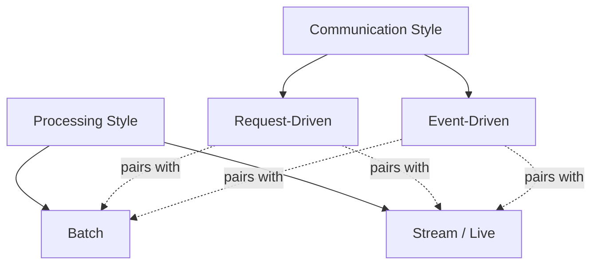

# Request-Driven, Event-Driven, Batch, and Stream Processing: How They Relate

## 1. They Answer Two Different Questions

A common confusion is treating these four as one list of alternatives. They're not — they sit on **two separate axes**, and any real system is a combination of one from each axis.

| Axis | Question it answers | Options |
|---|---|---|
| **Communication style** | *How does a service ask for or receive data?* | Request-driven / Event-driven |
| **Processing style** | *How is the data itself handled once it arrives?* | Batch / Stream (live) processing |

- **Request-driven vs. Event-driven** is about the *interaction pattern* between two parties — does the caller wait for a direct reply, or does it just announce something happened and move on?
- **Batch vs. Stream** is about the *shape of the data being processed* — is it a bounded, complete set processed all at once, or an unbounded, continuous flow processed as it arrives?

Because these axes are independent, you get four valid combinations — not a forced choice between four options.

---

## 2. Analogies

### Office Analogies for the Four Concepts

| Concept | Office Analogy |
|---|---|
| **Request-driven** | Cafeteria: order → pay → proceed |
| **Event-driven** | Fire alarm goes off; everyone reacts independently |
| **Stream** | Lobby's live headcount display, continuously updating as badges scan in/out |
| **Batch** | Filling in your timesheet at the end of the day |

> Request-driven

#### Asking a colleague a direct question in a 1:1 call and waiting for their answer before continuing the conversation

#### Requesting a meeting room booking and waiting for the confirmation before you walk over

> Event-driven

#### A calendar invite being accepted/declined — the organizer doesn't call each invitee, they just publish the invite and each person reacts on their own
#### A Slack message posted to a channel that multiple bots and teammates react to independently

> Stream

#### The "typing…" indicator in a chat app, updating continuously as someone types
#### The live participant count/reactions ticker during an all-hands Zoom call

> Batch

#### Payroll running once a month for everyone
#### A weekly "team status report" email compiled from the whole week's Jira tickets in one go

> Why the Fire Alarm + Lobby Headcount Pairing Works So Well

The reason this pairing is pedagogically useful is that it takes one physical location — the building entrance/lobby — and shows students that request-driven, event-driven, and stream processing aren't separate places in a system, they're separate lenses you can apply to the same place depending on what question you're asking.

All day long, badges tap in and out at the door. Each tap updates the lobby's live headcount display in real time — an unbounded, ongoing flow that never "finishes" during work hours. This is the stream: continuous data, continuously processed.

At some unpredictable moment, the fire alarm goes off. It doesn't ask permission, doesn't wait for a reply, and doesn't know who's listening — everyone in the building (people, HVAC system, elevator control, security desk) reacts independently, at their own pace. This is the event: a single announcement, decoupled from whoever responds to it.

Immediately after, security might use exactly the headcount stream from step 1 to answer a direct question: "How many people are still in the building right now?" That's a request-driven query — someone asking for a specific, immediate answer — but notice it's being answered using data that was already being maintained continuously by the stream. Nobody needed to run around counting heads on demand; the stream had already done that work.

This sequencing makes a point that's easy to say but hard to internalize until you see it in one scenario: the event (fire alarm) and the stream (headcount) are two completely independent things happening at the same location, and a request-driven query can sit on top of either one.

---

## 2. Quick Recap of Each

**Request-driven**: one service asks another for something and waits for a direct reply (REST, gRPC). Failure is visible immediately at the call site.

**Event-driven**: a service announces "X happened" without knowing who's listening; consumers react independently, later (Kafka, SNS/SQS). Failure is not visible to the producer — it shows up downstream or in monitoring.

**Batch processing**: a bounded, complete chunk of data (e.g. "yesterday's transactions") is processed all at once, on a schedule or on demand. Optimized for throughput over latency.

**Stream (live) processing**: an unbounded, continuous flow of data is processed record-by-record (or in small micro-batches) as it arrives. Optimized for low latency over throughput.

---

## 3. How the Four Combine — With Real Examples

### A. Request-driven + Batch
*A caller makes a direct request that kicks off — or asks about — a bounded chunk of work.*

**Example: End-of-day trade settlement report**
An operations team calls an internal API endpoint (`POST /reports/generate?date=2026-09-25`) to kick off the settlement report for a specific closed trading day. The API call itself is request-driven — it returns a job ID and, later, a status. But the actual work is batch: it's a bounded, complete day's worth of trades, processed as one job, not a live feed.

**Example: "Check payroll run status"**
A finance app calls `GET /payroll/runs/2026-09`, a request-driven synchronous lookup, to check on a monthly payroll batch job that ran overnight. The batch job itself was scheduled and bounded; the *status check* on top of it is request-driven.

### B. Request-driven + Stream
*A caller gets a direct, immediate answer that is computed from — or plugged into — a continuously flowing data source.*

**Example: Real-time fraud score lookup**
A payment gateway calls a fraud-scoring service synchronously during checkout (`POST /fraud/score`). That service, under the hood, maintains a continuously updated stream-processed model of the customer's recent transaction velocity (a live, unbounded feed of events). The caller still gets one direct, blocking answer — but the answer is backed by stream processing, not a static lookup table.

**Example: Live stock quote API**
A trading app calls `GET /quote/AAPL` and expects an immediate reply. Behind that endpoint, a stream processor is continuously consuming an unbounded feed of market ticks and maintaining the latest price in memory — request-driven at the edge, streaming underneath.

### C. Event-driven + Batch
*An event triggers a bounded, all-at-once job rather than an immediate direct reply.*

**Example: "File uploaded" triggers nightly aggregation**
An S3 `ObjectCreated` event fires when a data provider drops a new bounded CSV file. Rather than replying to anyone, this event triggers a scheduled batch job (e.g. an AWS Glue or Spark job) that processes the *entire* file as one bounded unit once it's in place. The trigger is event-driven; the processing is batch.

**Example: `OrderPlaced` triggers end-of-month invoice batch inclusion**
Each `OrderPlaced` event is captured and stored, but invoices aren't generated per event — they're generated by a monthly batch job that processes *all* the month's accumulated order events together as one bounded dataset.

### D. Event-driven + Stream
*This is the pairing most people mean when they say "event-driven architecture" in a modern, real-time system — events are processed continuously as they arrive.*

**Example: Ride-share driver location + ETA updates**
Every few seconds, a driver's app publishes a `LocationUpdated` event to a Kafka topic. A stream processor (e.g. Kafka Streams or Flink) continuously consumes this unbounded feed and recalculates ETAs in real time, pushing updates to the rider's app. Neither side is waiting on a direct reply — it's pure event-driven + stream.

**Example: Real-time fraud detection pipeline**
Every card swipe publishes a `TransactionAttempted` event. A stream processor scores each event within milliseconds against a rolling window of the customer's recent activity (an inherently unbounded stream) and publishes a `FraudFlagged` event if suspicious, which downstream systems consume independently.

---

## 4. Where the Real Overlap and Confusion Comes From

- **"Event-driven" is not the same as "real-time."** You can absolutely have event-driven + batch (section C) — the event just triggers a job that still processes a bounded chunk, possibly hours later. Don't assume "event-driven" implies low latency.
- **"Batch" is not the opposite of "request-driven."** A batch job can be *kicked off* by a synchronous API call (section A) — the triggering mechanism and the processing mechanism are two different layers of the same system.
- **Stream processing often lives *behind* a request-driven interface.** Many "real-time" APIs (live scores, live prices, live recommendations) are request-driven at the point of consumption, backed by a stream processor maintaining state continuously underneath (section B). The caller never sees the streaming — they just see a fast, fresh answer.
- **The same event can feed both a stream processor and a batch job.** It's common for one event topic (e.g. `OrderPlaced`) to be consumed twice: once by a stream processor for real-time inventory decrement, and once by a batch job that replays the whole day's events at midnight for reconciliation. The communication pattern (event-driven) stays constant; the processing pattern varies by consumer.

---

## 5. Summary Table

| Combination | What triggers the work | How the data is processed | Real example |
|---|---|---|---|
| Request-driven + Batch | Direct API call | Bounded chunk, all at once | Kicking off an end-of-day settlement report via API |
| Request-driven + Stream | Direct API call | Unbounded feed, maintained continuously underneath | Live stock quote API backed by a streaming price engine |
| Event-driven + Batch | Async event (e.g. file arrival) | Bounded chunk, all at once | S3 upload event triggering a nightly Spark aggregation job |
| Event-driven + Stream | Async event, continuous | Unbounded feed, processed as it arrives | Ride-share driver location events feeding real-time ETA updates |

**Rule of thumb:** ask "how do I *get* the data?" (request vs. event) and "what *shape* is the data in once I have it?" (batch vs. stream) as two separate questions — most architecture confusion comes from collapsing them into one.
