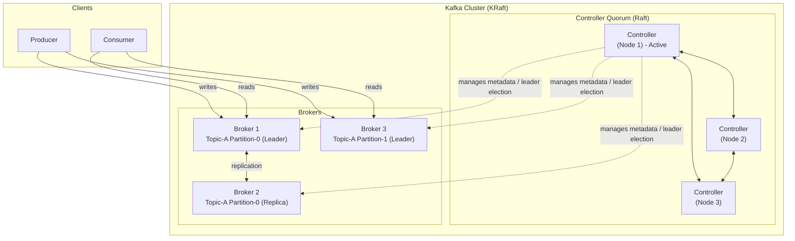

# Kafka in KRaft Mode — Docker Setup Guide

A complete reference for understanding, running, and checking the status of
a single-node Apache Kafka cluster (KRaft mode, no ZooKeeper) via Docker.

---

## Table of Contents

1. [Kafka Analogy — The Post Office](#1-kafka-analogy--the-post-office)
2. [Kafka Architecture (KRaft Mode)](#2-kafka-architecture-kraft-mode)
3. [Kafka Terminology Glossary](#3-kafka-terminology-glossary)
4. [The Docker Command — Step by Step](#4-the-docker-command--step-by-step)
5. [⚠️ Notes on This Configuration](#5-️-notes-on-this-configuration)
6. [Useful Kafka CLI Commands](#6-useful-kafka-cli-commands)

---

## 1. Kafka Analogy — The Post Office

Before diving into terms, here's a mental model that maps Kafka concepts to
something familiar: **a postal / courier system**.

| Kafka Concept | Post Office Analogy |
|---|---|
| **Broker** | A local post office branch that receives, stores, and hands out mail |
| **Cluster** | The entire postal network (all branches working together) |
| **Topic** | A named mailbox category, e.g. "Invoices" or "Newsletters" |
| **Partition** | Multiple sorting bins for the same mailbox category, so several clerks can work in parallel |
| **Producer** | A sender dropping off letters at the post office |
| **Consumer** | A recipient picking up letters from their mailbox |
| **Consumer Group** | A team of recipients splitting up the pickup workload so no one reads the same letter twice |
| **Offset** | The receipt number on each letter showing its position in the bin — lets you resume exactly where you left off |
| **Replication** | Photocopying each letter and storing copies at other branches, in case one branch burns down |
| **Leader / Follower (replica)** | The main branch that handles a bin's mail (leader) vs. backup branches holding copies (followers) |
| **Controller (KRaft)** | The regional office that keeps the master directory of which branch handles which bin, and reassigns work if a branch goes offline |
| **ZooKeeper (legacy)** | An external, separate directory service the regional office used to depend on — now built in-house (KRaft) instead |

Keep this table in mind — it's referenced throughout the glossary below.

---

## 2. Kafka Architecture (KRaft Mode)

In **KRaft mode**, Kafka no longer depends on ZooKeeper. Instead, a set of
nodes (which can double as brokers) form a **Raft consensus quorum** that
manages all cluster metadata internally.



**How it works, in short:**
1. **Producers** write records to a **topic**, which is split into
   **partitions** spread across **brokers**.
2. Each partition has one **leader** broker (handles reads/writes) and zero
   or more **follower/replica** brokers (keep copies for fault tolerance).
3. **Consumers** (often organized in **consumer groups**) read records back,
   tracking their position using **offsets**.
4. The **controller quorum** (KRaft) — a small set of nodes talking via the
   **Raft protocol** — keeps the authoritative record of cluster metadata:
   which brokers exist, which partition leader is where, topic configs, etc.
5. In a **single-node dev setup** (like the Docker command in this guide),
   one node plays *both* the broker and controller roles — so the diagram
   above collapses into a single box.

---

## 3. Kafka Terminology Glossary

| Term | Simple Explanation | Analogy |
|---|---|---|
| **Broker** | A single Kafka server that stores data and serves client requests. A cluster is made of multiple brokers. | A post office branch |
| **Cluster** | A group of brokers working together as one Kafka system. | The whole postal network |
| **Topic** | A named stream/category of records, like a table or feed name. | A mailbox category (e.g. "Invoices") |
| **Partition** | A topic is split into partitions so data can be written/read in parallel and scaled across brokers. Each partition is an ordered, append-only log. | Separate sorting bins for the same mailbox category |
| **Offset** | A sequential ID assigned to each record within a partition, marking its position. | The receipt/ticket number on a letter |
| **Producer** | A client application that writes (publishes) records to a topic. | The sender dropping off mail |
| **Consumer** | A client application that reads (subscribes to) records from a topic. | The recipient picking up mail |
| **Consumer Group** | A set of consumers sharing the work of reading a topic; each partition is read by only one consumer in the group at a time. | A team splitting pickup duty so no one reads the same letter twice |
| **Replication Factor** | The number of copies of each partition kept across different brokers, for fault tolerance. | Number of photocopies of a letter kept at different branches |
| **Leader (replica)** | The one replica of a partition that handles all reads/writes for it. | The main branch responsible for a bin |
| **Follower (replica)** | A replica that passively copies data from the leader, ready to take over if the leader fails. | Backup branches holding copies |
| **ISR (In-Sync Replicas)** | The set of replicas (leader + followers) that are fully caught up with the leader at any given time. | Branches confirmed to have the latest copies |
| **Controller** | The node (or quorum of nodes, in KRaft) responsible for cluster-wide metadata and decisions like partition leader election. | The regional office managing branch assignments |
| **KRaft (Kafka Raft)** | Kafka's built-in consensus protocol/mode that replaces ZooKeeper for metadata management, using the Raft algorithm. | The regional office managing its own directory in-house |
| **ZooKeeper (legacy)** | A separate external coordination service Kafka used to rely on for metadata before KRaft. Deprecated/removed as of Kafka 4.0. | An outsourced directory service the regional office used to call |
| **Node ID** | A unique numeric identifier for each node (broker and/or controller) in the cluster. | Each branch's unique ID number |
| **Cluster ID** | A unique identifier for the entire Kafka cluster, generated once at cluster formatting time. | The postal network's registered company ID |
| **Listener** | A network endpoint (host:port + protocol) that Kafka listens on for incoming connections. | The physical counter/window where a branch accepts drop-offs |
| **Advertised Listener** | The address Kafka tells clients to use when connecting, which may differ from the internal listen address (important in Docker/NAT setups). | The public mailing address printed on the branch's signage, vs. its internal loading dock address |
| **Inter-Broker Listener** | The listener brokers use to talk to each other (e.g., for replication). | The internal courier route between branches |
| **Quorum Voters** | The set of controller nodes that vote in the Raft consensus process for cluster metadata decisions. | The regional office's board members who vote on directory changes |
| **Consumer Offset (Topic)** | An internal Kafka topic (`__consumer_offsets`) that tracks how far each consumer group has read. | The logbook tracking which letters each pickup team has already collected |
| **Transaction / Transactional Log** | Kafka's mechanism for exactly-once, atomic writes across partitions/topics. | A single sealed package that must arrive completely or not at all |
| **Partition Leader Election** | The process of choosing a new leader replica when the current one fails. | Promoting a backup branch to "main branch" status when the original closes |
| **Retention** | How long Kafka keeps records in a topic before deleting them (time- or size-based). | How long a post office holds unclaimed mail before discarding it |
| **Bootstrap Server** | The initial broker address(es) a client connects to, in order to discover the rest of the cluster. | The main switchboard number you call first to get routed to the right branch |

---

## 4. The Docker Command — Step by Step

```bash
docker run -d --name kafka -p PRIVATE_IP:9092:9092 \
  -e KAFKA_NODE_ID=1 \
  -e KAFKA_PROCESS_ROLES=broker,controller \
  -e KAFKA_LISTENERS=PLAINTEXT://:9092,CONTROLLER://:9093 \
  -e KAFKA_ADVERTISED_LISTENERS=PLAINTEXT://PRIVATE_IP:9092 \
  -e KAFKA_LISTENER_SECURITY_PROTOCOL_MAP=PLAINTEXT:PLAINTEXT,CONTROLLER:PLAINTEXT \
  -e KAFKA_CONTROLLER_LISTENER_NAMES=CONTROLLER \
  -e KAFKA_CONTROLLER_QUORUM_VOTERS=1@127.0.0.1:9093 \
  -e KAFKA_INTER_BROKER_LISTENER_NAME=PLAINTEXT \
  -e KAFKA_OFFSETS_TOPIC_REPLICATION_FACTOR=1 \
  -e KAFKA_TRANSACTION_STATE_LOG_REPLICATION_FACTOR=1 \
  -e KAFKA_TRANSACTION_STATE_LOG_MIN_ISR=1 \
  -e CLUSTER_ID=4L6g3nShT-eMCtK--X86sw \
  apache/kafka:latest
```

This runs a **single-node Kafka cluster in KRaft mode** where the same
container acts as both **broker** and **controller** (see the glossary above
for both terms).

### `docker run -d --name kafka`
- `docker run` — starts a new container.
- `-d` — runs it in **detached mode** (background).
- `--name kafka` — names the container `kafka` for easy reference
  (`docker logs kafka`, `docker stop kafka`, `docker exec -it kafka ...`).

### `-p PRIVATE_IP:9092:9092`
- Maps container port `9092` to host port `9092`, bound only to
  `PRIVATE_IP` (not `0.0.0.0`).
- `9092` is Kafka's standard **client/broker** port used by producers and
  consumers.
- Binding to a private IP restricts access to that network interface only.

### `-e KAFKA_NODE_ID=1`
- A unique numeric **Node ID** for this node in the cluster (see glossary).
- Required for every node in KRaft mode, broker or controller.

### `-e KAFKA_PROCESS_ROLES=broker,controller`
- Declares this node's role(s): here it's **both** broker and controller —
  common in single-node/dev setups, replacing ZooKeeper's old job.

### `-e KAFKA_LISTENERS=PLAINTEXT://:9092,CONTROLLER://:9093`
- Defines the **listeners** Kafka opens inside the container:
  - `PLAINTEXT://:9092` — client traffic.
  - `CONTROLLER://:9093` — controller quorum traffic.

### `-e KAFKA_ADVERTISED_LISTENERS=PLAINTEXT://PRIVATE_IP:9092`
- The **advertised listener** — the address clients are told to reconnect
  to after their initial connection. Must be reachable by external clients,
  hence `PRIVATE_IP` instead of `localhost`.

### `-e KAFKA_LISTENER_SECURITY_PROTOCOL_MAP=PLAINTEXT:PLAINTEXT,CONTROLLER:PLAINTEXT`
- Maps each listener name to a security protocol. Both use unencrypted
  `PLAINTEXT` here — fine for dev, not for production.

### `-e KAFKA_CONTROLLER_LISTENER_NAMES=CONTROLLER`
- Tells Kafka which listener name is used for controller-to-controller
  (KRaft quorum) traffic.

### `-e KAFKA_CONTROLLER_QUORUM_VOTERS=1@127.0.0.1:9093`
- Defines the **quorum voters** — nodes participating in the Raft consensus
  group. Format: `nodeId@host:port`. Just one voter here (single-node).

### `-e KAFKA_INTER_BROKER_LISTENER_NAME=PLAINTEXT`
- Which listener brokers use to talk to each other (e.g. replication).

### `-e KAFKA_OFFSETS_TOPIC_REPLICATION_FACTOR=1`
- Replication factor for the internal `__consumer_offsets` topic. `1`
  because there's only one broker available.

### `-e KAFKA_TRANSACTION_STATE_LOG_REPLICATION_FACTOR=1`
- Replication factor for the internal `__transaction_state` topic (used for
  Kafka transactions). Also `1` for the same reason.

### `-e KAFKA_TRANSACTION_STATE_LOG_MIN_ISR=1`
- Minimum **in-sync replicas** required for the transaction state log.

### `-e CLUSTER_ID=4L6g3nShT-eMCtK--X86sw`
- The unique **Cluster ID**, written to storage on first startup. Every
  node in a cluster must share the same ID. Generate one with
  `kafka-storage.sh random-uuid`.

### `apache/kafka:latest`
- The official Apache Kafka Docker image — ships in KRaft mode by default.

---

## 5. ⚠️ Notes on This Configuration

This setup is meant for **local/dev/testing** use, not production:
- `PLAINTEXT` protocol = no encryption or authentication.
- Replication factor `1` everywhere = no fault tolerance (single point of failure).
- `KAFKA_CONTROLLER_QUORUM_VOTERS` uses `127.0.0.1`, which only works
  because broker and controller are the same process/container. In a real
  multi-node cluster, this would list the actual IPs of all controller nodes.

For production: use SSL/SASL listeners, replication factors of 3+, and a
proper multi-node controller quorum (typically 3 or 5 controller nodes).

---

## 6. Useful Kafka CLI Commands

Run via `docker exec -it kafka <command>` using the scripts bundled in the
`apache/kafka` image (`/opt/kafka/bin/`).

### Check if the broker is reachable
```bash
docker exec -it kafka /opt/kafka/bin/kafka-broker-api-versions.sh \
  --bootstrap-server PRIVATE_IP:9092
```

### List all topics
```bash
docker exec -it kafka /opt/kafka/bin/kafka-topics.sh \
  --bootstrap-server PRIVATE_IP:9092 --list
```

### Create a topic
```bash
docker exec -it kafka /opt/kafka/bin/kafka-topics.sh \
  --bootstrap-server PRIVATE_IP:9092 \
  --create --topic my-topic \
  --partitions 3 --replication-factor 1
```

### Describe a topic (partitions, leader, ISR, config)
```bash
docker exec -it kafka /opt/kafka/bin/kafka-topics.sh \
  --bootstrap-server PRIVATE_IP:9092 \
  --describe --topic my-topic
```

### Delete a topic
```bash
docker exec -it kafka /opt/kafka/bin/kafka-topics.sh \
  --bootstrap-server PRIVATE_IP:9092 \
  --delete --topic my-topic
```

### Produce test messages (interactive)
```bash
docker exec -it kafka /opt/kafka/bin/kafka-console-producer.sh \
  --bootstrap-server PRIVATE_IP:9092 --topic my-topic
```

### Consume messages (from the beginning)
```bash
docker exec -it kafka /opt/kafka/bin/kafka-console-consumer.sh \
  --bootstrap-server PRIVATE_IP:9092 \
  --topic my-topic --from-beginning
```

### List consumer groups
```bash
docker exec -it kafka /opt/kafka/bin/kafka-consumer-groups.sh \
  --bootstrap-server PRIVATE_IP:9092 --list
```

### Describe a consumer group (lag, offsets, assigned partitions)
```bash
docker exec -it kafka /opt/kafka/bin/kafka-consumer-groups.sh \
  --bootstrap-server PRIVATE_IP:9092 \
  --describe --group my-group
```

### Check cluster metadata / KRaft controller status
```bash
docker exec -it kafka /opt/kafka/bin/kafka-metadata-quorum.sh \
  --bootstrap-server PRIVATE_IP:9092 describe --status
```

### View broker/cluster-wide configs
```bash
docker exec -it kafka /opt/kafka/bin/kafka-configs.sh \
  --bootstrap-server PRIVATE_IP:9092 \
  --entity-type brokers --entity-default --describe
```

### Check container logs (Kafka startup / errors)
```bash
docker logs -f kafka
```

### Check container status
```bash
docker ps --filter name=kafka
```
