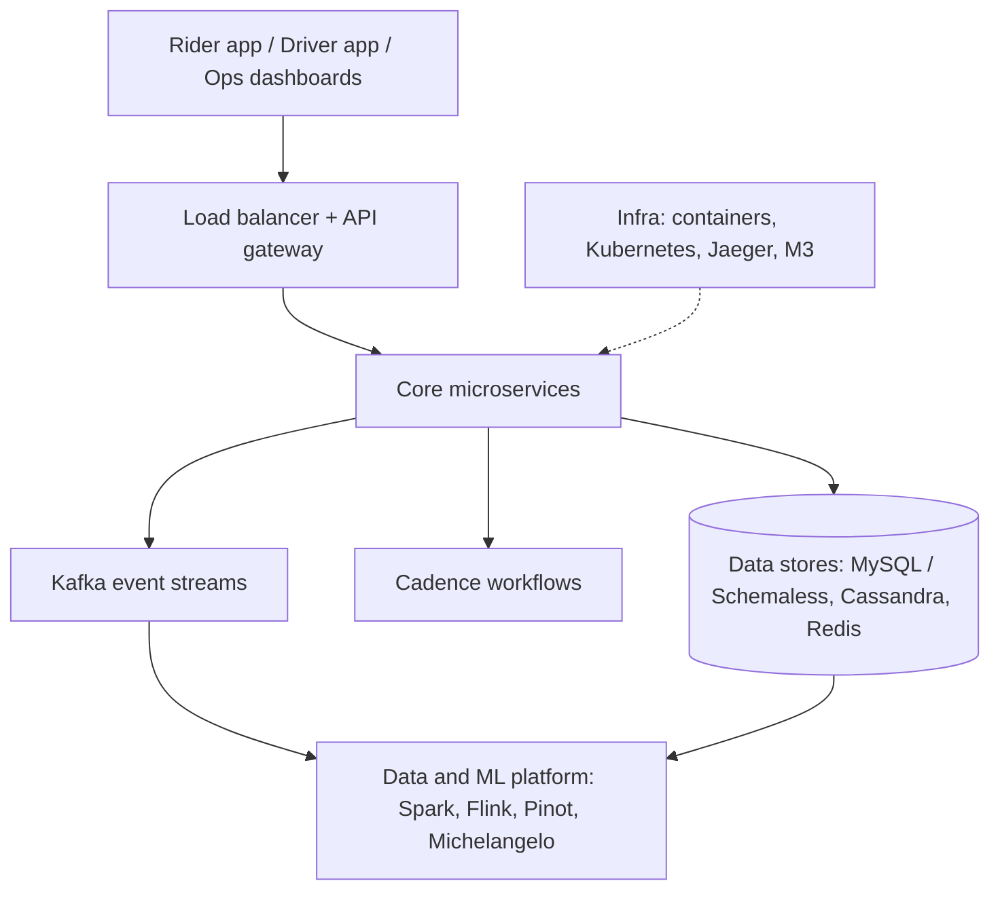
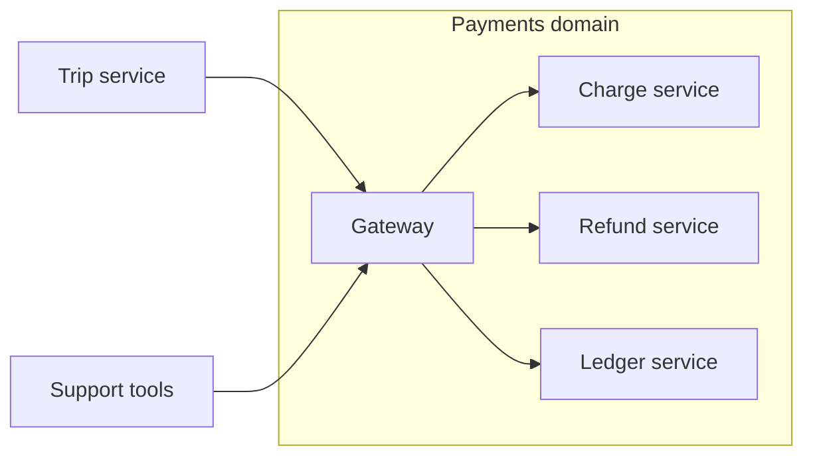
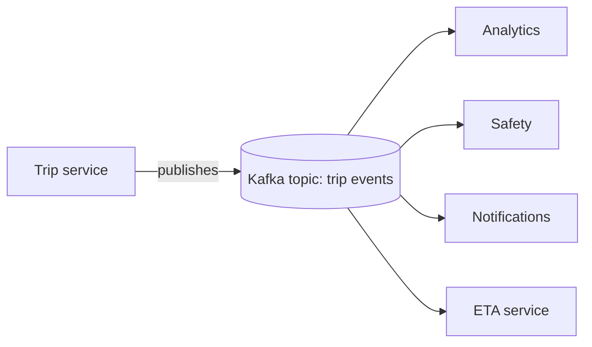
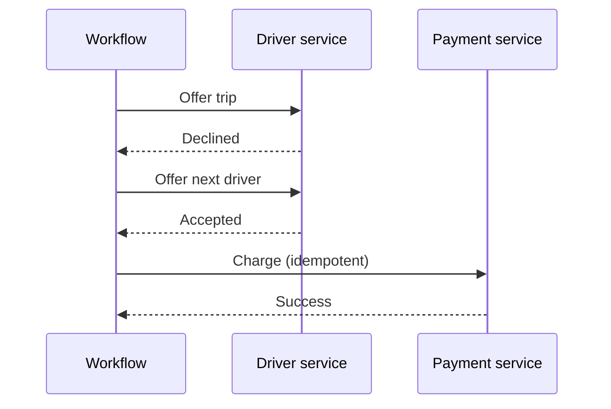
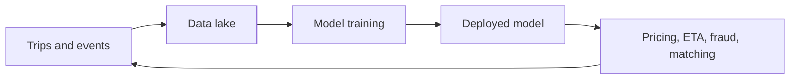

# Case Study: Why Uber's Architecture Looks the Way It Does

> A teaching document for fresh graduates. It explains not just *what* Uber's architecture contains, but *why* each choice was made, what the alternatives were, and what each choice costs.
>
> **Accuracy note:** This is built from Uber's public engineering blog posts, open-source projects and conference talks. It is simplified for teaching. Uber's internals change over time, so verify specifics against current sources before citing them as fact.

---

## Table of contents

1. [The problem Uber is solving](#1-the-problem-uber-is-solving)
2. [Requirements that shape the design](#2-requirements-that-shape-the-design)
3. [The architecture at a glance](#3-the-architecture-at-a-glance)
4. [Decision 1: Monolith to microservices](#4-decision-1-monolith-to-microservices)
5. [Decision 2: Domain-oriented structure](#5-decision-2-domain-oriented-structure)
6. [Decision 3: Event-driven backbone](#6-decision-3-event-driven-backbone)
7. [Decision 4: Polyglot persistence](#7-decision-4-polyglot-persistence)
8. [Decision 5: Geospatial indexing for matching](#8-decision-5-geospatial-indexing-for-matching)
9. [Decision 6: Workflow orchestration](#9-decision-6-workflow-orchestration)
10. [Decision 7: Real-time and batch data platforms](#10-decision-7-real-time-and-batch-data-platforms)
11. [Decision 8: Observability as a first-class layer](#11-decision-8-observability-as-a-first-class-layer)
12. [Decision 9: Build, buy or open-source](#12-decision-9-build-buy-or-open-source)
13. [Designing for failure](#13-designing-for-failure)
14. [Cost of the architecture](#14-the-costs-of-this-architecture)
15. [Role of each technology](#15-technology-roles-summary)
16. [Discussion questions and exercises](#16-discussion-questions-and-exercises)
17. [Key takeaways](#17-key-takeaways)

---

## 1. The problem Uber is solving

Uber is a **real-time, two-sided, location-based marketplace**. At any moment:

- Riders are asking "where's my car?"
- Drivers are moving through the city and reporting their position continuously.
- The system must match them, price the trip, guide the driver, track the journey and take payment.

Each of those words puts pressure on the architecture:

| Property | What it means | Architectural pressure |
|---|---|---|
| Real-time | Decisions in seconds, not minutes | Low-latency services, in-memory data, streaming |
| Two-sided | Two kinds of user with different apps and needs | Separate but coordinated services |
| Location-based | Everything depends on "where" | Specialised geospatial data structures |
| Marketplace | Supply and demand move constantly | Dynamic pricing, ML, analytics |
| Money involved | Errors cost trust and cause legal trouble | Strong consistency, auditability |
| Many cities | Different laws, currencies, payment methods | Configurability, regional isolation |

Good architecture starts from this table. Technology choices come second.

---

## 2. Requirements that shape the design

### Functional requirements (what the system does)

- Request a ride, see a price estimate and ETA.
- Match the rider with a nearby driver.
- Track the trip live on both phones.
- Charge the rider and pay the driver.
- Rate each other, get receipts, contact support.

### Non-functional requirements (how well it must do it)

| Requirement | Why it matters at Uber |
|---|---|
| **Low latency** | A slow match feels like a broken app. |
| **High availability** | Downtime strands people and costs drivers earnings. |
| **Horizontal scalability** | Demand spikes (Friday night, New Year's Eve, rain) are huge and predictable only roughly. |
| **Consistency where it counts** | Never double-charge. Never assign one driver to two riders. |
| **Eventual consistency where it's fine** | A driver's dot on the map can be a second behind. |
| **Team autonomy** | Thousands of engineers must ship without blocking each other. |
| **Debuggability** | When something breaks, find *which* of hundreds of services caused it. |

> **Teaching point:** Notice that "consistency" appears twice with different strictness. Mature architectures don't pick one setting for the whole system. They choose per use case.

---

## 3. The architecture at a glance

Layers, from top to bottom:

1. **Clients:** rider app, driver app, internal dashboards.
2. **Edge:** load balancers, API gateway, authentication, rate limiting.
3. **Core services:** matching, trips, pricing, payments, maps/ETA, notifications, fraud, profiles.
4. **Async backbone:** Kafka for events, Cadence for long-running workflows.
5. **Data stores:** MySQL/Schemaless, Cassandra, Redis.
6. **Data and ML platform:** Hadoop/Spark, Flink, Pinot, Michelangelo.
7. **Infra and observability:** containers, Kubernetes, Jaeger, M3.

The rest of this document takes each major decision in turn.

---

## 4. Decision 1: Monolith to microservices

### What happened

Uber's early system was reported to be a monolith, essentially one large codebase and one database. That's a sensible start. Public accounts describe Uber later splitting it into separate services as the company grew across cities and teams.

### Why start with a monolith?

A monolith is the *right* first architecture for most products:

- One codebase, one deployment, easy to reason about.
- Fast iteration when the team is five people.
- No network calls between components, so fewer failure modes.

### Why it stopped working

| Monolith pain | What it looked like at scale |
|---|---|
| **Deployment coupling** | A small change to pricing means redeploying everything, including payments. |
| **Blast radius** | One memory leak or bad query takes the entire product down. |
| **Team contention** | Hundreds of engineers editing one codebase means merge conflicts and slow releases. |
| **Uniform scaling** | To scale matching, you must scale *everything*, which is wasteful. |
| **Technology lock-in** | One language and framework for every problem. |

### What microservices bought them

- **Independent deployment:** the pricing team ships without asking the payments team.
- **Independent scaling:** matching gets more machines during peak without touching profile services.
- **Fault isolation:** a failing notification service shouldn't stop a trip from completing.
- **Technology fit:** Go or Java for high-concurrency services, Python for ML-heavy ones, Node.js for some I/O-heavy ones.

### What it cost

- Every call that used to be a function call is now a **network call** that can be slow or fail.
- **Distributed debugging** becomes hard. One user action may touch dozens of services.
- **Data consistency** across services needs deliberate design.
- **Operational overhead:** you now run, monitor and secure hundreds of things.

> **Rule of thumb for graduates:** Microservices solve *organisational and scaling* problems. If you don't have those problems, you probably don't need them yet.

---

## 5. Decision 2: Domain-oriented structure

### The problem microservices created

After years of growth, having a very large number of services produced a different kind of complexity. A single feature might touch dozens of services owned by different teams, and nobody understood the whole picture. Uber's engineers described this in public writing and proposed a **Domain-Oriented Microservice Architecture (DOMA)**.

### The idea

Group related services into **domains** (for example "rider experience", "trip lifecycle", "payments") with a clear, small **public interface** per domain. Teams outside a domain talk to its gateway, not to its internal services.

### Why this is a good choice

- **Reduces coupling:** internals can change without breaking outsiders.
- **Clearer ownership:** a domain has an owner and a contract.
- **Easier onboarding:** a new engineer learns the domain map before the service map.

### Trade-off

You add an extra layer (the domain gateway). That's one more hop, and it needs disciplined governance so it doesn't become a bottleneck.

> **Teaching point:** This is an example of an architecture *correcting itself*. Microservices were the answer to the monolith. Domains were the answer to microservice sprawl.

---

## 6. Decision 3: Event-driven backbone

### The problem with synchronous calls everywhere

Imagine the trip service calling every interested service directly when a trip starts: analytics, safety, ETA, notifications, receipts. Problems:

- The trip service must **know about every consumer**.
- If one consumer is slow, the trip service is slow.
- Adding a new feature means editing the trip service.

### The solution: publish events

The trip service publishes a **"trip started"** event to Kafka. Anyone who cares subscribes.

### Why Kafka specifically

| Property | Why it fits Uber |
|---|---|
| High throughput | Location pings from millions of devices |
| Durable, replayable log | A new consumer can read history and catch up |
| Decoupling | Producers and consumers evolve independently |
| Ordering within a partition | Events for one trip stay in sequence |

### When to use RPC vs events

| Use a direct call (RPC) when... | Use an event when... |
|---|---|
| The caller needs an answer *now* (price quote) | The caller just needs to announce something happened |
| One specific service must act | Many services may care, now or later |
| Failure should be reported immediately | Eventual processing is acceptable |

### Costs

- **Eventual consistency:** consumers see updates a moment later.
- **Harder to trace:** a flow that spans events is harder to follow than a call stack.
- **Operational burden:** running Kafka at this scale is a serious engineering task in itself.

---

## 7. Decision 4: Polyglot persistence

"Polyglot persistence" means using **different databases for different jobs** instead of forcing all data into one.

### Why one database doesn't work

| Data | Needs | A poor fit |
|---|---|---|
| Trips, accounts, payments | Transactions, correctness | A store with weak consistency |
| GPS pings, event history | Massive write throughput, easy horizontal scaling | A single relational server |
| Hot lookups (session, cached prices) | Sub-millisecond reads | Disk-based stores |

### The common matches

| Store | Strength | Typical Uber-style use |
|---|---|---|
| **MySQL / Schemaless (Docstore)** | Reliable, transactional, well understood | Trip and account records |
| **Cassandra** | Write-heavy, scales out, tolerates node loss | Large event and location-style data |
| **Redis** | In-memory speed | Caching, short-lived state |

### Interesting history

Uber has publicly described moving from PostgreSQL to MySQL for some workloads and building **Schemaless**, a scalable layer on top of MySQL. The lesson is not "MySQL beats PostgreSQL". It's that **teams pick what meets their access pattern and operational experience, and revisit it when scale changes**.

### The CAP trade-off, in plain words

When a network partition happens, a distributed store must choose between staying **consistent** and staying **available**.

- Payment records: choose consistency, so reject or delay rather than risk a wrong charge.
- Driver map position: choose availability, since slightly stale is fine.

### Costs

- More technologies for engineers to learn and operate.
- Data lives in several places, so you need clear rules about which store is the **source of truth**.

---

## 8. Decision 5: Geospatial indexing for matching

### The naive approach

"Find all drivers within 2 km of the rider." If you compute distance to every driver in the city, that's far too slow at scale.

### The idea: divide the world into cells

Index every location into a **cell ID**. To find nearby drivers, look in the rider's cell and its neighbours.

Uber open-sourced **H3**, a hexagonal hierarchical grid.

### Why hexagons?

| Shape | Neighbour distances |
|---|---|
| Squares | Edge neighbours are close, diagonal neighbours are farther, so distances are uneven |
| **Hexagons** | All six neighbours are equally far, which gives smoother "nearby" logic and cleaner analytics |

### Why it matters beyond matching

The same cells are reused for:

- **Surge pricing** (demand and supply per cell)
- **Demand forecasting** (predict where riders will request next)
- **Analytics** (compare regions consistently)

> **Teaching point:** The right data structure turns a slow problem into a fast one. Picking one good indexing scheme also gave several teams a shared vocabulary.

### Costs

- Cell boundaries create edge cases (a driver just across a boundary).
- Choosing the **resolution** (cell size) is a tuning decision with trade-offs.

---

## 9. Decision 6: Workflow orchestration

### The problem

Many business processes are **multi-step and long-running**:

1. Hold payment authorisation.
2. Offer trip to driver A.
3. Wait up to N seconds. If declined, offer to driver B.
4. After the trip, calculate the fare.
5. Charge. If the charge fails, retry later.
6. Send the receipt.

Writing this with ad-hoc code, timers and database flags leads to fragile systems. A server crash mid-process can leave things half-done.

### The solution: durable workflow engine

**Cadence** (open-sourced by Uber, and forked as **Temporal** by its creators) records every step. If a worker crashes, another resumes exactly where it stopped.

### Why this matters

- **Reliability:** retries and timeouts are built in.
- **Readability:** business logic looks like normal code, not a web of callbacks.
- **Auditability:** there's a history of exactly what happened.

### Idempotency, a must-know concept

Retries are safe only if repeating an operation doesn't repeat its effect. A charge request carries a unique key, so the payment service can say "I've already processed this one" instead of billing twice.

---

## 10. Decision 7: Real-time and batch data platforms

Uber needs to answer two very different kinds of question:

| Question | Time scale | Tool category |
|---|---|---|
| "How many trips started in this city in the last 5 minutes?" | Seconds | Stream processing + real-time analytics (Flink, Pinot) |
| "How did weekend demand change over the last year?" | Hours | Batch processing (Hadoop, Spark) |
| "What will this trip's ETA be?" | Milliseconds, with models trained offline | ML platform (Michelangelo) |

### Why not one system?

- Streaming systems are great at freshness but not at scanning years of history cheaply.
- Batch systems are great at big historical jobs but too slow for live dashboards.

### The ML feedback loop

Every ride produces data, and that data improves the models that run the next ride. This loop is a core competitive advantage, which is why Uber built a shared ML platform instead of letting every team reinvent training and deployment.

---

## 11. Decision 8: Observability as a first-class layer

### The problem

When a rider says "the app was slow", the cause could be any of dozens of services. Without tools, debugging is guesswork.

### The three pillars

| Pillar | Question it answers | Uber-related tool |
|---|---|---|
| **Traces** | "Where did this request spend its time?" | Jaeger |
| **Metrics** | "How is the system behaving overall?" | M3 |
| **Logs** | "What exactly happened in this component?" | Centralised logging |

### Why it's an architectural decision, not an afterthought

- Tracing only works if **every service propagates trace IDs**, so it must be built into shared libraries and frameworks.
- Alerting and on-call practices depend on consistent metrics.
- A microservice architecture without observability is unmanageable.

---

## 12. Decision 9: Build, buy or open-source

Uber has built and open-sourced many tools (H3, Jaeger, M3, Cadence among them) and also relies heavily on open-source it didn't create (Kafka, Spark, Flink, MySQL, Cassandra, Redis).

### Rough decision framework

| Situation | Typical choice |
|---|---|
| Commodity problem, mature tools exist | **Adopt** open-source or buy |
| Existing tool nearly fits | **Adopt and contribute or extend** |
| No tool fits your scale or constraints, and it's core to your edge | **Build**, then consider open-sourcing |
| Not a differentiator and not scale-critical | **Buy** or use a managed service |

### Why open-source your own tools?

- Attracts engineering talent and outside contributions.
- Gets external bug reports and improvements.
- Builds standards that make hiring and integration easier.

### Cost of building

Every internal tool is a product you must **maintain forever**. Build only when the benefit clearly outweighs that ongoing cost.

---

## 13. Designing for failure

At this scale, something is *always* failing. Design assumes it.

| Failure | Defensive design |
|---|---|
| A service is slow | **Timeouts** and **circuit breakers** so callers stop waiting and fail fast |
| A service is down | **Fallbacks** (cached data, degraded features) |
| A request is retried | **Idempotency keys** |
| A traffic spike hits | **Autoscaling**, **rate limiting**, **load shedding** |
| A data centre or region fails | **Multi-region deployment** and failover |
| A bad deploy ships | **Canary releases**, **feature flags**, quick rollback |
| A driver loses signal mid-trip | Trip state kept server-side; app **reconnects and resyncs** |

> **Teaching point:** "What happens when this fails?" is the single most useful question in system design.

---

## 14. The costs of this architecture

No architecture is free. Be honest about what Uber paid.

| Benefit | Cost |
|---|---|
| Team autonomy | Coordination overhead, inconsistent practices unless governed |
| Independent scaling | Many moving parts to deploy and monitor |
| Fault isolation | More network failure modes |
| Right tool per job | Many technologies to master |
| Event-driven decoupling | Harder end-to-end reasoning, eventual consistency |
| ML-driven decisions | Heavy platform investment and data-quality burden |

An architecture is **a set of trade-offs that fits a particular company at a particular size**. A five-person startup copying Uber's design would be making a serious mistake.

---

## 15. Technology roles summary

| Concern | Technology | Role | Why this choice |
|---|---|---|---|
| Service code | Go, Java, Python, Node.js | Business logic | Match language to workload |
| Sync communication | RPC (gRPC/Thrift-style) | Request/response between services | Efficient, typed contracts |
| Async communication | Kafka | Event streaming | Decoupling, throughput, replay |
| Workflows | Cadence / Temporal | Durable multi-step processes | Reliability, retries, auditability |
| Transactional data | MySQL, Schemaless/Docstore | Trips, accounts, payments | Consistency, maturity |
| High-volume data | Cassandra | Write-heavy storage | Horizontal scale, availability |
| Caching | Redis | Hot reads | Speed |
| Geospatial | H3 | Matching, surge, analytics | Fast neighbour lookup |
| Batch analytics | Hadoop, Spark | Historical analysis | Cheap large-scale processing |
| Stream processing | Flink | Live computation | Low-latency events |
| Real-time analytics | Pinot | Live queries and dashboards | Fast aggregation on fresh data |
| ML platform | Michelangelo | Train, deploy, monitor models | Shared tooling, consistency |
| Containers | Kubernetes | Run and scale services | Standardised deployment |
| Tracing | Jaeger | Follow a request across services | Debuggability |
| Metrics | M3 | Monitor system health | Scale-ready metrics storage |

---

## 16. Discussion questions and exercises

### Warm-up

1. Why is a monolith a *good* choice for a new startup?
2. Name two things that get harder when you move to microservices.
3. Which Uber data needs strong consistency, and which can be eventually consistent?

### Intermediate

4. The matching service goes down for two minutes. What should riders and drivers experience? What design would make that outcome possible?
5. A payment request times out. Should the system retry? What must be true for the retry to be safe?
6. Why would using one database for everything eventually cause trouble at Uber's scale?

### Design exercises

7. **Surge pricing:** Which data do you need, where does it come from, how fresh must it be, and which components compute and serve it?
8. **Rider cancellation:** Sketch the workflow. What states exist? What gets refunded? What events get published?
9. **Add a new feature (e.g. "share trip with a friend"):** Which existing events can you reuse? Which services change? Which don't?
10. **Expand to a new country:** What changes (payments, regulation, languages, maps)? Which architectural decisions make this easier or harder?

### Stretch

11. Argue for *and* against merging two small services into one. What evidence would decide it?
12. Design an observability plan: which three metrics and which alerts would you set for the matching service?

---

## 17. Key takeaways

1. **Start from requirements, not technology.** Latency, consistency, scale and team size drive the design.
2. **Every decision is a trade-off.** Be able to say what you gained *and* what you paid.
3. **Match the tool to the access pattern.** Different data deserves different storage.
4. **Decouple with events, but know when you need an immediate answer.**
5. **Assume failure.** Timeouts, retries, idempotency and fallbacks are core design, not extras.
6. **You can't operate what you can't see.** Observability is part of the architecture.
7. **Architectures evolve.** Monolith, then microservices, then domains: each step solved the previous step's problem.
8. **Don't copy another company's architecture.** Copy their *reasoning process*.

---

### Further reading (search these titles)

- Uber Engineering Blog: posts on DOMA, H3, Schemaless, Kafka usage, Michelangelo, Cadence and Jaeger
- Designing Data-Intensive Applications by Martin Kleppmann
- Building Microservices by Sam Newman
